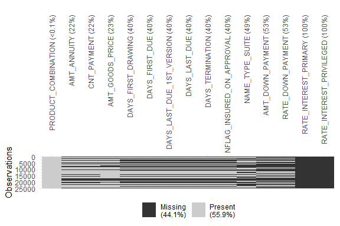

Identyfikacja docelowych odbiorców pożyczki
================
Julia Labuda (191145), Wojciech Zgliniecki ()

# **Wstęp**

Studium przypadku „Kredyty – Identyfikacja docelowych odbiorców
pożyczki” koncentruje się na analizie ryzyka w procesie udzielania
finansowania klientom. Wykorzystując techniki eksploracyjnej analizy
danych (EDA), projekt ma na celu zrozumienie, w jaki sposób cechy
konsumentów oraz parametry pożyczek wpływają na prawdopodobieństwo
terminowej spłaty zobowiązań.

Firmy udzielające pożyczek stoją przed podwójnym wyzwaniem: z jednej
strony ryzykują utratę potencjalnych zysków, jeśli odrzucą wnioski
klientów zdolnych do spłaty, z drugiej – mogą ponieść straty finansowe,
jeśli zaakceptują wnioski osób, które nie wywiążą się ze zobowiązań.
Dlatego kluczowe jest zidentyfikowanie zmiennych, które są silnymi
wskaźnikami niewypłacalności.

## Opis danych

W niniejszym projekcie wykorzystane zostaną dane z pliku
„previous_application_new.csv”, zawierającego informacje o decyzjach
kredytowych (zatwierdzone, anulowane, odrzucone, niewykorzystane), oraz
słownik zmiennych „opis_zmiennych.xlsx”, który ułatwi interpretację
atrybutów. Analiza pozwoli wskazać wzorce zachowań klientów i czynniki
ryzyka, które mogą wspierać proces podejmowania decyzji kredytowych.

## Repozytorium na GitHub

Prace zostały wykonane z użyciem systemu kontroli wersji Git, a jako
zdalne miejsce do przechowania repozytorium wykorzystano platformę
GitHub.

Link do
repozytorium:<https://github.com/wzgliniecki/projekt_zespolowy_analiza.git>

## Użyte biblioteki

Podczas analizy użyto następujących bibliotek:

``` r
library(readr)
library(gt)
library(tidyverse)
library(naniar)
library(VIM)
library(ggplot2)
library(kableExtra)
library(dplyr)
library(tidyr)
library(corrplot)
library(ggstatsplot)
```

## Wczytanie i wizualizacja danych

W tabeli pokazano 10 pierwszych wierszy zbioru danych. Można zauważyć,
że w zbiorze występują brakujące dane.

``` r
dane <- read_csv("Data/previous_application_new.csv")
```

    ## Rows: 25000 Columns: 37
    ## ── Column specification ────────────────────────────────────────────────────────
    ## Delimiter: ","
    ## chr (16): NAME_CONTRACT_TYPE, WEEKDAY_APPR_PROCESS_START, FLAG_LAST_APPL_PER...
    ## dbl (21): SK_ID_PREV, SK_ID_CURR, AMT_ANNUITY, AMT_APPLICATION, AMT_CREDIT, ...
    ## 
    ## ℹ Use `spec()` to retrieve the full column specification for this data.
    ## ℹ Specify the column types or set `show_col_types = FALSE` to quiet this message.

Zbiór previous_application_new.csv zawiera 25 000 obserwacji oraz 37
zmiennych.

16 zmiennych jest typu tekstowego (chr) – np. NAME_CONTRACT_TYPE,
WEEKDAY_APPR_PROCESS_START, FLAG_LAST_APPL_PER.

21 zmiennych to zmienne numeryczne (dbl) – np. SK_ID_PREV, SK_ID_CURR,
AMT_ANNUITY, AMT_APPLICATION, AMT_CREDIT.

Dane obejmują zarówno informacje opisowe, jak i wartości liczbowe
związane z kwotami i identyfikatorami. Dzięki temu możliwa jest analiza
zarówno jakościowa, jak i ilościowa wniosków kredytowych.

``` r
gt(head(dane,10))
```

<div id="lgaomcojun" style="padding-left:0px;padding-right:0px;padding-top:10px;padding-bottom:10px;overflow-x:auto;overflow-y:auto;width:auto;height:auto;">
<style>#lgaomcojun table {
  font-family: system-ui, 'Segoe UI', Roboto, Helvetica, Arial, sans-serif, 'Apple Color Emoji', 'Segoe UI Emoji', 'Segoe UI Symbol', 'Noto Color Emoji';
  -webkit-font-smoothing: antialiased;
  -moz-osx-font-smoothing: grayscale;
}
&#10;#lgaomcojun thead, #lgaomcojun tbody, #lgaomcojun tfoot, #lgaomcojun tr, #lgaomcojun td, #lgaomcojun th {
  border-style: none;
}
&#10;#lgaomcojun p {
  margin: 0;
  padding: 0;
}
&#10;#lgaomcojun .gt_table {
  display: table;
  border-collapse: collapse;
  line-height: normal;
  margin-left: auto;
  margin-right: auto;
  color: #333333;
  font-size: 16px;
  font-weight: normal;
  font-style: normal;
  background-color: #FFFFFF;
  width: auto;
  border-top-style: solid;
  border-top-width: 2px;
  border-top-color: #A8A8A8;
  border-right-style: none;
  border-right-width: 2px;
  border-right-color: #D3D3D3;
  border-bottom-style: solid;
  border-bottom-width: 2px;
  border-bottom-color: #A8A8A8;
  border-left-style: none;
  border-left-width: 2px;
  border-left-color: #D3D3D3;
}
&#10;#lgaomcojun .gt_caption {
  padding-top: 4px;
  padding-bottom: 4px;
}
&#10;#lgaomcojun .gt_title {
  color: #333333;
  font-size: 125%;
  font-weight: initial;
  padding-top: 4px;
  padding-bottom: 4px;
  padding-left: 5px;
  padding-right: 5px;
  border-bottom-color: #FFFFFF;
  border-bottom-width: 0;
}
&#10;#lgaomcojun .gt_subtitle {
  color: #333333;
  font-size: 85%;
  font-weight: initial;
  padding-top: 3px;
  padding-bottom: 5px;
  padding-left: 5px;
  padding-right: 5px;
  border-top-color: #FFFFFF;
  border-top-width: 0;
}
&#10;#lgaomcojun .gt_heading {
  background-color: #FFFFFF;
  text-align: center;
  border-bottom-color: #FFFFFF;
  border-left-style: none;
  border-left-width: 1px;
  border-left-color: #D3D3D3;
  border-right-style: none;
  border-right-width: 1px;
  border-right-color: #D3D3D3;
}
&#10;#lgaomcojun .gt_bottom_border {
  border-bottom-style: solid;
  border-bottom-width: 2px;
  border-bottom-color: #D3D3D3;
}
&#10;#lgaomcojun .gt_col_headings {
  border-top-style: solid;
  border-top-width: 2px;
  border-top-color: #D3D3D3;
  border-bottom-style: solid;
  border-bottom-width: 2px;
  border-bottom-color: #D3D3D3;
  border-left-style: none;
  border-left-width: 1px;
  border-left-color: #D3D3D3;
  border-right-style: none;
  border-right-width: 1px;
  border-right-color: #D3D3D3;
}
&#10;#lgaomcojun .gt_col_heading {
  color: #333333;
  background-color: #FFFFFF;
  font-size: 100%;
  font-weight: normal;
  text-transform: inherit;
  border-left-style: none;
  border-left-width: 1px;
  border-left-color: #D3D3D3;
  border-right-style: none;
  border-right-width: 1px;
  border-right-color: #D3D3D3;
  vertical-align: bottom;
  padding-top: 5px;
  padding-bottom: 6px;
  padding-left: 5px;
  padding-right: 5px;
  overflow-x: hidden;
}
&#10;#lgaomcojun .gt_column_spanner_outer {
  color: #333333;
  background-color: #FFFFFF;
  font-size: 100%;
  font-weight: normal;
  text-transform: inherit;
  padding-top: 0;
  padding-bottom: 0;
  padding-left: 4px;
  padding-right: 4px;
}
&#10;#lgaomcojun .gt_column_spanner_outer:first-child {
  padding-left: 0;
}
&#10;#lgaomcojun .gt_column_spanner_outer:last-child {
  padding-right: 0;
}
&#10;#lgaomcojun .gt_column_spanner {
  border-bottom-style: solid;
  border-bottom-width: 2px;
  border-bottom-color: #D3D3D3;
  vertical-align: bottom;
  padding-top: 5px;
  padding-bottom: 5px;
  overflow-x: hidden;
  display: inline-block;
  width: 100%;
}
&#10;#lgaomcojun .gt_spanner_row {
  border-bottom-style: hidden;
}
&#10;#lgaomcojun .gt_group_heading {
  padding-top: 8px;
  padding-bottom: 8px;
  padding-left: 5px;
  padding-right: 5px;
  color: #333333;
  background-color: #FFFFFF;
  font-size: 100%;
  font-weight: initial;
  text-transform: inherit;
  border-top-style: solid;
  border-top-width: 2px;
  border-top-color: #D3D3D3;
  border-bottom-style: solid;
  border-bottom-width: 2px;
  border-bottom-color: #D3D3D3;
  border-left-style: none;
  border-left-width: 1px;
  border-left-color: #D3D3D3;
  border-right-style: none;
  border-right-width: 1px;
  border-right-color: #D3D3D3;
  vertical-align: middle;
  text-align: left;
}
&#10;#lgaomcojun .gt_empty_group_heading {
  padding: 0.5px;
  color: #333333;
  background-color: #FFFFFF;
  font-size: 100%;
  font-weight: initial;
  border-top-style: solid;
  border-top-width: 2px;
  border-top-color: #D3D3D3;
  border-bottom-style: solid;
  border-bottom-width: 2px;
  border-bottom-color: #D3D3D3;
  vertical-align: middle;
}
&#10;#lgaomcojun .gt_from_md > :first-child {
  margin-top: 0;
}
&#10;#lgaomcojun .gt_from_md > :last-child {
  margin-bottom: 0;
}
&#10;#lgaomcojun .gt_row {
  padding-top: 8px;
  padding-bottom: 8px;
  padding-left: 5px;
  padding-right: 5px;
  margin: 10px;
  border-top-style: solid;
  border-top-width: 1px;
  border-top-color: #D3D3D3;
  border-left-style: none;
  border-left-width: 1px;
  border-left-color: #D3D3D3;
  border-right-style: none;
  border-right-width: 1px;
  border-right-color: #D3D3D3;
  vertical-align: middle;
  overflow-x: hidden;
}
&#10;#lgaomcojun .gt_stub {
  color: #333333;
  background-color: #FFFFFF;
  font-size: 100%;
  font-weight: initial;
  text-transform: inherit;
  border-right-style: solid;
  border-right-width: 2px;
  border-right-color: #D3D3D3;
  padding-left: 5px;
  padding-right: 5px;
}
&#10;#lgaomcojun .gt_stub_row_group {
  color: #333333;
  background-color: #FFFFFF;
  font-size: 100%;
  font-weight: initial;
  text-transform: inherit;
  border-right-style: solid;
  border-right-width: 2px;
  border-right-color: #D3D3D3;
  padding-left: 5px;
  padding-right: 5px;
  vertical-align: top;
}
&#10;#lgaomcojun .gt_row_group_first td {
  border-top-width: 2px;
}
&#10;#lgaomcojun .gt_row_group_first th {
  border-top-width: 2px;
}
&#10;#lgaomcojun .gt_summary_row {
  color: #333333;
  background-color: #FFFFFF;
  text-transform: inherit;
  padding-top: 8px;
  padding-bottom: 8px;
  padding-left: 5px;
  padding-right: 5px;
}
&#10;#lgaomcojun .gt_first_summary_row {
  border-top-style: solid;
  border-top-color: #D3D3D3;
}
&#10;#lgaomcojun .gt_first_summary_row.thick {
  border-top-width: 2px;
}
&#10;#lgaomcojun .gt_last_summary_row {
  padding-top: 8px;
  padding-bottom: 8px;
  padding-left: 5px;
  padding-right: 5px;
  border-bottom-style: solid;
  border-bottom-width: 2px;
  border-bottom-color: #D3D3D3;
}
&#10;#lgaomcojun .gt_grand_summary_row {
  color: #333333;
  background-color: #FFFFFF;
  text-transform: inherit;
  padding-top: 8px;
  padding-bottom: 8px;
  padding-left: 5px;
  padding-right: 5px;
}
&#10;#lgaomcojun .gt_first_grand_summary_row {
  padding-top: 8px;
  padding-bottom: 8px;
  padding-left: 5px;
  padding-right: 5px;
  border-top-style: double;
  border-top-width: 6px;
  border-top-color: #D3D3D3;
}
&#10;#lgaomcojun .gt_last_grand_summary_row_top {
  padding-top: 8px;
  padding-bottom: 8px;
  padding-left: 5px;
  padding-right: 5px;
  border-bottom-style: double;
  border-bottom-width: 6px;
  border-bottom-color: #D3D3D3;
}
&#10;#lgaomcojun .gt_striped {
  background-color: rgba(128, 128, 128, 0.05);
}
&#10;#lgaomcojun .gt_table_body {
  border-top-style: solid;
  border-top-width: 2px;
  border-top-color: #D3D3D3;
  border-bottom-style: solid;
  border-bottom-width: 2px;
  border-bottom-color: #D3D3D3;
}
&#10;#lgaomcojun .gt_footnotes {
  color: #333333;
  background-color: #FFFFFF;
  border-bottom-style: none;
  border-bottom-width: 2px;
  border-bottom-color: #D3D3D3;
  border-left-style: none;
  border-left-width: 2px;
  border-left-color: #D3D3D3;
  border-right-style: none;
  border-right-width: 2px;
  border-right-color: #D3D3D3;
}
&#10;#lgaomcojun .gt_footnote {
  margin: 0px;
  font-size: 90%;
  padding-top: 4px;
  padding-bottom: 4px;
  padding-left: 5px;
  padding-right: 5px;
}
&#10;#lgaomcojun .gt_sourcenotes {
  color: #333333;
  background-color: #FFFFFF;
  border-bottom-style: none;
  border-bottom-width: 2px;
  border-bottom-color: #D3D3D3;
  border-left-style: none;
  border-left-width: 2px;
  border-left-color: #D3D3D3;
  border-right-style: none;
  border-right-width: 2px;
  border-right-color: #D3D3D3;
}
&#10;#lgaomcojun .gt_sourcenote {
  font-size: 90%;
  padding-top: 4px;
  padding-bottom: 4px;
  padding-left: 5px;
  padding-right: 5px;
}
&#10;#lgaomcojun .gt_left {
  text-align: left;
}
&#10;#lgaomcojun .gt_center {
  text-align: center;
}
&#10;#lgaomcojun .gt_right {
  text-align: right;
  font-variant-numeric: tabular-nums;
}
&#10;#lgaomcojun .gt_font_normal {
  font-weight: normal;
}
&#10;#lgaomcojun .gt_font_bold {
  font-weight: bold;
}
&#10;#lgaomcojun .gt_font_italic {
  font-style: italic;
}
&#10;#lgaomcojun .gt_super {
  font-size: 65%;
}
&#10;#lgaomcojun .gt_footnote_marks {
  font-size: 75%;
  vertical-align: 0.4em;
  position: initial;
}
&#10;#lgaomcojun .gt_asterisk {
  font-size: 100%;
  vertical-align: 0;
}
&#10;#lgaomcojun .gt_indent_1 {
  text-indent: 5px;
}
&#10;#lgaomcojun .gt_indent_2 {
  text-indent: 10px;
}
&#10;#lgaomcojun .gt_indent_3 {
  text-indent: 15px;
}
&#10;#lgaomcojun .gt_indent_4 {
  text-indent: 20px;
}
&#10;#lgaomcojun .gt_indent_5 {
  text-indent: 25px;
}
&#10;#lgaomcojun .katex-display {
  display: inline-flex !important;
  margin-bottom: 0.75em !important;
}
&#10;#lgaomcojun div.Reactable > div.rt-table > div.rt-thead > div.rt-tr.rt-tr-group-header > div.rt-th-group:after {
  height: 0px !important;
}
</style>
<table class="gt_table" data-quarto-disable-processing="false" data-quarto-bootstrap="false">
  <thead>
    <tr class="gt_col_headings">
      <th class="gt_col_heading gt_columns_bottom_border gt_right" rowspan="1" colspan="1" scope="col" id="SK_ID_PREV">SK_ID_PREV</th>
      <th class="gt_col_heading gt_columns_bottom_border gt_right" rowspan="1" colspan="1" scope="col" id="SK_ID_CURR">SK_ID_CURR</th>
      <th class="gt_col_heading gt_columns_bottom_border gt_left" rowspan="1" colspan="1" scope="col" id="NAME_CONTRACT_TYPE">NAME_CONTRACT_TYPE</th>
      <th class="gt_col_heading gt_columns_bottom_border gt_right" rowspan="1" colspan="1" scope="col" id="AMT_ANNUITY">AMT_ANNUITY</th>
      <th class="gt_col_heading gt_columns_bottom_border gt_right" rowspan="1" colspan="1" scope="col" id="AMT_APPLICATION">AMT_APPLICATION</th>
      <th class="gt_col_heading gt_columns_bottom_border gt_right" rowspan="1" colspan="1" scope="col" id="AMT_CREDIT">AMT_CREDIT</th>
      <th class="gt_col_heading gt_columns_bottom_border gt_right" rowspan="1" colspan="1" scope="col" id="AMT_DOWN_PAYMENT">AMT_DOWN_PAYMENT</th>
      <th class="gt_col_heading gt_columns_bottom_border gt_right" rowspan="1" colspan="1" scope="col" id="AMT_GOODS_PRICE">AMT_GOODS_PRICE</th>
      <th class="gt_col_heading gt_columns_bottom_border gt_left" rowspan="1" colspan="1" scope="col" id="WEEKDAY_APPR_PROCESS_START">WEEKDAY_APPR_PROCESS_START</th>
      <th class="gt_col_heading gt_columns_bottom_border gt_right" rowspan="1" colspan="1" scope="col" id="HOUR_APPR_PROCESS_START">HOUR_APPR_PROCESS_START</th>
      <th class="gt_col_heading gt_columns_bottom_border gt_left" rowspan="1" colspan="1" scope="col" id="FLAG_LAST_APPL_PER_CONTRACT">FLAG_LAST_APPL_PER_CONTRACT</th>
      <th class="gt_col_heading gt_columns_bottom_border gt_right" rowspan="1" colspan="1" scope="col" id="NFLAG_LAST_APPL_IN_DAY">NFLAG_LAST_APPL_IN_DAY</th>
      <th class="gt_col_heading gt_columns_bottom_border gt_right" rowspan="1" colspan="1" scope="col" id="RATE_DOWN_PAYMENT">RATE_DOWN_PAYMENT</th>
      <th class="gt_col_heading gt_columns_bottom_border gt_right" rowspan="1" colspan="1" scope="col" id="RATE_INTEREST_PRIMARY">RATE_INTEREST_PRIMARY</th>
      <th class="gt_col_heading gt_columns_bottom_border gt_right" rowspan="1" colspan="1" scope="col" id="RATE_INTEREST_PRIVILEGED">RATE_INTEREST_PRIVILEGED</th>
      <th class="gt_col_heading gt_columns_bottom_border gt_left" rowspan="1" colspan="1" scope="col" id="NAME_CASH_LOAN_PURPOSE">NAME_CASH_LOAN_PURPOSE</th>
      <th class="gt_col_heading gt_columns_bottom_border gt_left" rowspan="1" colspan="1" scope="col" id="NAME_CONTRACT_STATUS">NAME_CONTRACT_STATUS</th>
      <th class="gt_col_heading gt_columns_bottom_border gt_right" rowspan="1" colspan="1" scope="col" id="DAYS_DECISION">DAYS_DECISION</th>
      <th class="gt_col_heading gt_columns_bottom_border gt_left" rowspan="1" colspan="1" scope="col" id="NAME_PAYMENT_TYPE">NAME_PAYMENT_TYPE</th>
      <th class="gt_col_heading gt_columns_bottom_border gt_left" rowspan="1" colspan="1" scope="col" id="CODE_REJECT_REASON">CODE_REJECT_REASON</th>
      <th class="gt_col_heading gt_columns_bottom_border gt_left" rowspan="1" colspan="1" scope="col" id="NAME_TYPE_SUITE">NAME_TYPE_SUITE</th>
      <th class="gt_col_heading gt_columns_bottom_border gt_left" rowspan="1" colspan="1" scope="col" id="NAME_CLIENT_TYPE">NAME_CLIENT_TYPE</th>
      <th class="gt_col_heading gt_columns_bottom_border gt_left" rowspan="1" colspan="1" scope="col" id="NAME_GOODS_CATEGORY">NAME_GOODS_CATEGORY</th>
      <th class="gt_col_heading gt_columns_bottom_border gt_left" rowspan="1" colspan="1" scope="col" id="NAME_PORTFOLIO">NAME_PORTFOLIO</th>
      <th class="gt_col_heading gt_columns_bottom_border gt_left" rowspan="1" colspan="1" scope="col" id="NAME_PRODUCT_TYPE">NAME_PRODUCT_TYPE</th>
      <th class="gt_col_heading gt_columns_bottom_border gt_left" rowspan="1" colspan="1" scope="col" id="CHANNEL_TYPE">CHANNEL_TYPE</th>
      <th class="gt_col_heading gt_columns_bottom_border gt_right" rowspan="1" colspan="1" scope="col" id="SELLERPLACE_AREA">SELLERPLACE_AREA</th>
      <th class="gt_col_heading gt_columns_bottom_border gt_left" rowspan="1" colspan="1" scope="col" id="NAME_SELLER_INDUSTRY">NAME_SELLER_INDUSTRY</th>
      <th class="gt_col_heading gt_columns_bottom_border gt_right" rowspan="1" colspan="1" scope="col" id="CNT_PAYMENT">CNT_PAYMENT</th>
      <th class="gt_col_heading gt_columns_bottom_border gt_left" rowspan="1" colspan="1" scope="col" id="NAME_YIELD_GROUP">NAME_YIELD_GROUP</th>
      <th class="gt_col_heading gt_columns_bottom_border gt_left" rowspan="1" colspan="1" scope="col" id="PRODUCT_COMBINATION">PRODUCT_COMBINATION</th>
      <th class="gt_col_heading gt_columns_bottom_border gt_right" rowspan="1" colspan="1" scope="col" id="DAYS_FIRST_DRAWING">DAYS_FIRST_DRAWING</th>
      <th class="gt_col_heading gt_columns_bottom_border gt_right" rowspan="1" colspan="1" scope="col" id="DAYS_FIRST_DUE">DAYS_FIRST_DUE</th>
      <th class="gt_col_heading gt_columns_bottom_border gt_right" rowspan="1" colspan="1" scope="col" id="DAYS_LAST_DUE_1ST_VERSION">DAYS_LAST_DUE_1ST_VERSION</th>
      <th class="gt_col_heading gt_columns_bottom_border gt_right" rowspan="1" colspan="1" scope="col" id="DAYS_LAST_DUE">DAYS_LAST_DUE</th>
      <th class="gt_col_heading gt_columns_bottom_border gt_right" rowspan="1" colspan="1" scope="col" id="DAYS_TERMINATION">DAYS_TERMINATION</th>
      <th class="gt_col_heading gt_columns_bottom_border gt_right" rowspan="1" colspan="1" scope="col" id="NFLAG_INSURED_ON_APPROVAL">NFLAG_INSURED_ON_APPROVAL</th>
    </tr>
  </thead>
  <tbody class="gt_table_body">
    <tr><td headers="SK_ID_PREV" class="gt_row gt_right">1044104</td>
<td headers="SK_ID_CURR" class="gt_row gt_right">358675</td>
<td headers="NAME_CONTRACT_TYPE" class="gt_row gt_left">Cash loans</td>
<td headers="AMT_ANNUITY" class="gt_row gt_right">NA</td>
<td headers="AMT_APPLICATION" class="gt_row gt_right">0</td>
<td headers="AMT_CREDIT" class="gt_row gt_right">0</td>
<td headers="AMT_DOWN_PAYMENT" class="gt_row gt_right">NA</td>
<td headers="AMT_GOODS_PRICE" class="gt_row gt_right">NA</td>
<td headers="WEEKDAY_APPR_PROCESS_START" class="gt_row gt_left">FRIDAY</td>
<td headers="HOUR_APPR_PROCESS_START" class="gt_row gt_right">16</td>
<td headers="FLAG_LAST_APPL_PER_CONTRACT" class="gt_row gt_left">Y</td>
<td headers="NFLAG_LAST_APPL_IN_DAY" class="gt_row gt_right">1</td>
<td headers="RATE_DOWN_PAYMENT" class="gt_row gt_right">NA</td>
<td headers="RATE_INTEREST_PRIMARY" class="gt_row gt_right">NA</td>
<td headers="RATE_INTEREST_PRIVILEGED" class="gt_row gt_right">NA</td>
<td headers="NAME_CASH_LOAN_PURPOSE" class="gt_row gt_left">XNA</td>
<td headers="NAME_CONTRACT_STATUS" class="gt_row gt_left">Canceled</td>
<td headers="DAYS_DECISION" class="gt_row gt_right">-169</td>
<td headers="NAME_PAYMENT_TYPE" class="gt_row gt_left">XNA</td>
<td headers="CODE_REJECT_REASON" class="gt_row gt_left">XAP</td>
<td headers="NAME_TYPE_SUITE" class="gt_row gt_left">NA</td>
<td headers="NAME_CLIENT_TYPE" class="gt_row gt_left">Repeater</td>
<td headers="NAME_GOODS_CATEGORY" class="gt_row gt_left">XNA</td>
<td headers="NAME_PORTFOLIO" class="gt_row gt_left">XNA</td>
<td headers="NAME_PRODUCT_TYPE" class="gt_row gt_left">XNA</td>
<td headers="CHANNEL_TYPE" class="gt_row gt_left">Credit and cash offices</td>
<td headers="SELLERPLACE_AREA" class="gt_row gt_right">-1</td>
<td headers="NAME_SELLER_INDUSTRY" class="gt_row gt_left">XNA</td>
<td headers="CNT_PAYMENT" class="gt_row gt_right">NA</td>
<td headers="NAME_YIELD_GROUP" class="gt_row gt_left">XNA</td>
<td headers="PRODUCT_COMBINATION" class="gt_row gt_left">Cash</td>
<td headers="DAYS_FIRST_DRAWING" class="gt_row gt_right">NA</td>
<td headers="DAYS_FIRST_DUE" class="gt_row gt_right">NA</td>
<td headers="DAYS_LAST_DUE_1ST_VERSION" class="gt_row gt_right">NA</td>
<td headers="DAYS_LAST_DUE" class="gt_row gt_right">NA</td>
<td headers="DAYS_TERMINATION" class="gt_row gt_right">NA</td>
<td headers="NFLAG_INSURED_ON_APPROVAL" class="gt_row gt_right">NA</td></tr>
    <tr><td headers="SK_ID_PREV" class="gt_row gt_right">1228470</td>
<td headers="SK_ID_CURR" class="gt_row gt_right">344960</td>
<td headers="NAME_CONTRACT_TYPE" class="gt_row gt_left">Cash loans</td>
<td headers="AMT_ANNUITY" class="gt_row gt_right">16015.860</td>
<td headers="AMT_APPLICATION" class="gt_row gt_right">378000</td>
<td headers="AMT_CREDIT" class="gt_row gt_right">378000</td>
<td headers="AMT_DOWN_PAYMENT" class="gt_row gt_right">NA</td>
<td headers="AMT_GOODS_PRICE" class="gt_row gt_right">378000</td>
<td headers="WEEKDAY_APPR_PROCESS_START" class="gt_row gt_left">SUNDAY</td>
<td headers="HOUR_APPR_PROCESS_START" class="gt_row gt_right">12</td>
<td headers="FLAG_LAST_APPL_PER_CONTRACT" class="gt_row gt_left">Y</td>
<td headers="NFLAG_LAST_APPL_IN_DAY" class="gt_row gt_right">1</td>
<td headers="RATE_DOWN_PAYMENT" class="gt_row gt_right">NA</td>
<td headers="RATE_INTEREST_PRIMARY" class="gt_row gt_right">NA</td>
<td headers="RATE_INTEREST_PRIVILEGED" class="gt_row gt_right">NA</td>
<td headers="NAME_CASH_LOAN_PURPOSE" class="gt_row gt_left">XNA</td>
<td headers="NAME_CONTRACT_STATUS" class="gt_row gt_left">Refused</td>
<td headers="DAYS_DECISION" class="gt_row gt_right">-474</td>
<td headers="NAME_PAYMENT_TYPE" class="gt_row gt_left">XNA</td>
<td headers="CODE_REJECT_REASON" class="gt_row gt_left">HC</td>
<td headers="NAME_TYPE_SUITE" class="gt_row gt_left">NA</td>
<td headers="NAME_CLIENT_TYPE" class="gt_row gt_left">Repeater</td>
<td headers="NAME_GOODS_CATEGORY" class="gt_row gt_left">XNA</td>
<td headers="NAME_PORTFOLIO" class="gt_row gt_left">Cash</td>
<td headers="NAME_PRODUCT_TYPE" class="gt_row gt_left">x-sell</td>
<td headers="CHANNEL_TYPE" class="gt_row gt_left">Contact center</td>
<td headers="SELLERPLACE_AREA" class="gt_row gt_right">-1</td>
<td headers="NAME_SELLER_INDUSTRY" class="gt_row gt_left">XNA</td>
<td headers="CNT_PAYMENT" class="gt_row gt_right">36</td>
<td headers="NAME_YIELD_GROUP" class="gt_row gt_left">low_normal</td>
<td headers="PRODUCT_COMBINATION" class="gt_row gt_left">Cash X-Sell: low</td>
<td headers="DAYS_FIRST_DRAWING" class="gt_row gt_right">NA</td>
<td headers="DAYS_FIRST_DUE" class="gt_row gt_right">NA</td>
<td headers="DAYS_LAST_DUE_1ST_VERSION" class="gt_row gt_right">NA</td>
<td headers="DAYS_LAST_DUE" class="gt_row gt_right">NA</td>
<td headers="DAYS_TERMINATION" class="gt_row gt_right">NA</td>
<td headers="NFLAG_INSURED_ON_APPROVAL" class="gt_row gt_right">NA</td></tr>
    <tr><td headers="SK_ID_PREV" class="gt_row gt_right">1212786</td>
<td headers="SK_ID_CURR" class="gt_row gt_right">208259</td>
<td headers="NAME_CONTRACT_TYPE" class="gt_row gt_left">Consumer loans</td>
<td headers="AMT_ANNUITY" class="gt_row gt_right">6190.965</td>
<td headers="AMT_APPLICATION" class="gt_row gt_right">30141</td>
<td headers="AMT_CREDIT" class="gt_row gt_right">31635</td>
<td headers="AMT_DOWN_PAYMENT" class="gt_row gt_right">0</td>
<td headers="AMT_GOODS_PRICE" class="gt_row gt_right">30141</td>
<td headers="WEEKDAY_APPR_PROCESS_START" class="gt_row gt_left">THURSDAY</td>
<td headers="HOUR_APPR_PROCESS_START" class="gt_row gt_right">20</td>
<td headers="FLAG_LAST_APPL_PER_CONTRACT" class="gt_row gt_left">Y</td>
<td headers="NFLAG_LAST_APPL_IN_DAY" class="gt_row gt_right">1</td>
<td headers="RATE_DOWN_PAYMENT" class="gt_row gt_right">0.0000000</td>
<td headers="RATE_INTEREST_PRIMARY" class="gt_row gt_right">NA</td>
<td headers="RATE_INTEREST_PRIVILEGED" class="gt_row gt_right">NA</td>
<td headers="NAME_CASH_LOAN_PURPOSE" class="gt_row gt_left">XAP</td>
<td headers="NAME_CONTRACT_STATUS" class="gt_row gt_left">Approved</td>
<td headers="DAYS_DECISION" class="gt_row gt_right">-2226</td>
<td headers="NAME_PAYMENT_TYPE" class="gt_row gt_left">Cash through the bank</td>
<td headers="CODE_REJECT_REASON" class="gt_row gt_left">XAP</td>
<td headers="NAME_TYPE_SUITE" class="gt_row gt_left">Unaccompanied</td>
<td headers="NAME_CLIENT_TYPE" class="gt_row gt_left">Repeater</td>
<td headers="NAME_GOODS_CATEGORY" class="gt_row gt_left">Photo / Cinema Equipment</td>
<td headers="NAME_PORTFOLIO" class="gt_row gt_left">POS</td>
<td headers="NAME_PRODUCT_TYPE" class="gt_row gt_left">XNA</td>
<td headers="CHANNEL_TYPE" class="gt_row gt_left">Country-wide</td>
<td headers="SELLERPLACE_AREA" class="gt_row gt_right">1500</td>
<td headers="NAME_SELLER_INDUSTRY" class="gt_row gt_left">Consumer electronics</td>
<td headers="CNT_PAYMENT" class="gt_row gt_right">6</td>
<td headers="NAME_YIELD_GROUP" class="gt_row gt_left">high</td>
<td headers="PRODUCT_COMBINATION" class="gt_row gt_left">POS household with interest</td>
<td headers="DAYS_FIRST_DRAWING" class="gt_row gt_right">365243</td>
<td headers="DAYS_FIRST_DUE" class="gt_row gt_right">-2195</td>
<td headers="DAYS_LAST_DUE_1ST_VERSION" class="gt_row gt_right">-2045</td>
<td headers="DAYS_LAST_DUE" class="gt_row gt_right">-2045</td>
<td headers="DAYS_TERMINATION" class="gt_row gt_right">-2041</td>
<td headers="NFLAG_INSURED_ON_APPROVAL" class="gt_row gt_right">0</td></tr>
    <tr><td headers="SK_ID_PREV" class="gt_row gt_right">2750575</td>
<td headers="SK_ID_CURR" class="gt_row gt_right">293651</td>
<td headers="NAME_CONTRACT_TYPE" class="gt_row gt_left">Cash loans</td>
<td headers="AMT_ANNUITY" class="gt_row gt_right">12598.200</td>
<td headers="AMT_APPLICATION" class="gt_row gt_right">67500</td>
<td headers="AMT_CREDIT" class="gt_row gt_right">67500</td>
<td headers="AMT_DOWN_PAYMENT" class="gt_row gt_right">NA</td>
<td headers="AMT_GOODS_PRICE" class="gt_row gt_right">67500</td>
<td headers="WEEKDAY_APPR_PROCESS_START" class="gt_row gt_left">WEDNESDAY</td>
<td headers="HOUR_APPR_PROCESS_START" class="gt_row gt_right">9</td>
<td headers="FLAG_LAST_APPL_PER_CONTRACT" class="gt_row gt_left">Y</td>
<td headers="NFLAG_LAST_APPL_IN_DAY" class="gt_row gt_right">1</td>
<td headers="RATE_DOWN_PAYMENT" class="gt_row gt_right">NA</td>
<td headers="RATE_INTEREST_PRIMARY" class="gt_row gt_right">NA</td>
<td headers="RATE_INTEREST_PRIVILEGED" class="gt_row gt_right">NA</td>
<td headers="NAME_CASH_LOAN_PURPOSE" class="gt_row gt_left">XNA</td>
<td headers="NAME_CONTRACT_STATUS" class="gt_row gt_left">Approved</td>
<td headers="DAYS_DECISION" class="gt_row gt_right">-486</td>
<td headers="NAME_PAYMENT_TYPE" class="gt_row gt_left">Cash through the bank</td>
<td headers="CODE_REJECT_REASON" class="gt_row gt_left">XAP</td>
<td headers="NAME_TYPE_SUITE" class="gt_row gt_left">NA</td>
<td headers="NAME_CLIENT_TYPE" class="gt_row gt_left">Repeater</td>
<td headers="NAME_GOODS_CATEGORY" class="gt_row gt_left">XNA</td>
<td headers="NAME_PORTFOLIO" class="gt_row gt_left">Cash</td>
<td headers="NAME_PRODUCT_TYPE" class="gt_row gt_left">x-sell</td>
<td headers="CHANNEL_TYPE" class="gt_row gt_left">Country-wide</td>
<td headers="SELLERPLACE_AREA" class="gt_row gt_right">60</td>
<td headers="NAME_SELLER_INDUSTRY" class="gt_row gt_left">Furniture</td>
<td headers="CNT_PAYMENT" class="gt_row gt_right">6</td>
<td headers="NAME_YIELD_GROUP" class="gt_row gt_left">middle</td>
<td headers="PRODUCT_COMBINATION" class="gt_row gt_left">Cash X-Sell: middle</td>
<td headers="DAYS_FIRST_DRAWING" class="gt_row gt_right">365243</td>
<td headers="DAYS_FIRST_DUE" class="gt_row gt_right">-456</td>
<td headers="DAYS_LAST_DUE_1ST_VERSION" class="gt_row gt_right">-306</td>
<td headers="DAYS_LAST_DUE" class="gt_row gt_right">-306</td>
<td headers="DAYS_TERMINATION" class="gt_row gt_right">-300</td>
<td headers="NFLAG_INSURED_ON_APPROVAL" class="gt_row gt_right">0</td></tr>
    <tr><td headers="SK_ID_PREV" class="gt_row gt_right">2188643</td>
<td headers="SK_ID_CURR" class="gt_row gt_right">251267</td>
<td headers="NAME_CONTRACT_TYPE" class="gt_row gt_left">Cash loans</td>
<td headers="AMT_ANNUITY" class="gt_row gt_right">16591.500</td>
<td headers="AMT_APPLICATION" class="gt_row gt_right">135000</td>
<td headers="AMT_CREDIT" class="gt_row gt_right">135000</td>
<td headers="AMT_DOWN_PAYMENT" class="gt_row gt_right">0</td>
<td headers="AMT_GOODS_PRICE" class="gt_row gt_right">135000</td>
<td headers="WEEKDAY_APPR_PROCESS_START" class="gt_row gt_left">SATURDAY</td>
<td headers="HOUR_APPR_PROCESS_START" class="gt_row gt_right">20</td>
<td headers="FLAG_LAST_APPL_PER_CONTRACT" class="gt_row gt_left">Y</td>
<td headers="NFLAG_LAST_APPL_IN_DAY" class="gt_row gt_right">1</td>
<td headers="RATE_DOWN_PAYMENT" class="gt_row gt_right">0.0000000</td>
<td headers="RATE_INTEREST_PRIMARY" class="gt_row gt_right">NA</td>
<td headers="RATE_INTEREST_PRIVILEGED" class="gt_row gt_right">NA</td>
<td headers="NAME_CASH_LOAN_PURPOSE" class="gt_row gt_left">XNA</td>
<td headers="NAME_CONTRACT_STATUS" class="gt_row gt_left">Approved</td>
<td headers="DAYS_DECISION" class="gt_row gt_right">-2799</td>
<td headers="NAME_PAYMENT_TYPE" class="gt_row gt_left">XNA</td>
<td headers="CODE_REJECT_REASON" class="gt_row gt_left">XAP</td>
<td headers="NAME_TYPE_SUITE" class="gt_row gt_left">NA</td>
<td headers="NAME_CLIENT_TYPE" class="gt_row gt_left">Refreshed</td>
<td headers="NAME_GOODS_CATEGORY" class="gt_row gt_left">XNA</td>
<td headers="NAME_PORTFOLIO" class="gt_row gt_left">Cash</td>
<td headers="NAME_PRODUCT_TYPE" class="gt_row gt_left">x-sell</td>
<td headers="CHANNEL_TYPE" class="gt_row gt_left">Country-wide</td>
<td headers="SELLERPLACE_AREA" class="gt_row gt_right">-1</td>
<td headers="NAME_SELLER_INDUSTRY" class="gt_row gt_left">Consumer electronics</td>
<td headers="CNT_PAYMENT" class="gt_row gt_right">10</td>
<td headers="NAME_YIELD_GROUP" class="gt_row gt_left">middle</td>
<td headers="PRODUCT_COMBINATION" class="gt_row gt_left">Cash Street: middle</td>
<td headers="DAYS_FIRST_DRAWING" class="gt_row gt_right">365243</td>
<td headers="DAYS_FIRST_DUE" class="gt_row gt_right">-2769</td>
<td headers="DAYS_LAST_DUE_1ST_VERSION" class="gt_row gt_right">-2499</td>
<td headers="DAYS_LAST_DUE" class="gt_row gt_right">-2499</td>
<td headers="DAYS_TERMINATION" class="gt_row gt_right">-2490</td>
<td headers="NFLAG_INSURED_ON_APPROVAL" class="gt_row gt_right">0</td></tr>
    <tr><td headers="SK_ID_PREV" class="gt_row gt_right">2337373</td>
<td headers="SK_ID_CURR" class="gt_row gt_right">394154</td>
<td headers="NAME_CONTRACT_TYPE" class="gt_row gt_left">Consumer loans</td>
<td headers="AMT_ANNUITY" class="gt_row gt_right">39423.150</td>
<td headers="AMT_APPLICATION" class="gt_row gt_right">3015000</td>
<td headers="AMT_CREDIT" class="gt_row gt_right">1035000</td>
<td headers="AMT_DOWN_PAYMENT" class="gt_row gt_right">1980000</td>
<td headers="AMT_GOODS_PRICE" class="gt_row gt_right">3015000</td>
<td headers="WEEKDAY_APPR_PROCESS_START" class="gt_row gt_left">SATURDAY</td>
<td headers="HOUR_APPR_PROCESS_START" class="gt_row gt_right">9</td>
<td headers="FLAG_LAST_APPL_PER_CONTRACT" class="gt_row gt_left">Y</td>
<td headers="NFLAG_LAST_APPL_IN_DAY" class="gt_row gt_right">1</td>
<td headers="RATE_DOWN_PAYMENT" class="gt_row gt_right">0.7152239</td>
<td headers="RATE_INTEREST_PRIMARY" class="gt_row gt_right">NA</td>
<td headers="RATE_INTEREST_PRIVILEGED" class="gt_row gt_right">NA</td>
<td headers="NAME_CASH_LOAN_PURPOSE" class="gt_row gt_left">XAP</td>
<td headers="NAME_CONTRACT_STATUS" class="gt_row gt_left">Refused</td>
<td headers="DAYS_DECISION" class="gt_row gt_right">-789</td>
<td headers="NAME_PAYMENT_TYPE" class="gt_row gt_left">Cash through the bank</td>
<td headers="CODE_REJECT_REASON" class="gt_row gt_left">VERIF</td>
<td headers="NAME_TYPE_SUITE" class="gt_row gt_left">NA</td>
<td headers="NAME_CLIENT_TYPE" class="gt_row gt_left">New</td>
<td headers="NAME_GOODS_CATEGORY" class="gt_row gt_left">XNA</td>
<td headers="NAME_PORTFOLIO" class="gt_row gt_left">Cars</td>
<td headers="NAME_PRODUCT_TYPE" class="gt_row gt_left">XNA</td>
<td headers="CHANNEL_TYPE" class="gt_row gt_left">Car dealer</td>
<td headers="SELLERPLACE_AREA" class="gt_row gt_right">329</td>
<td headers="NAME_SELLER_INDUSTRY" class="gt_row gt_left">Industry</td>
<td headers="CNT_PAYMENT" class="gt_row gt_right">36</td>
<td headers="NAME_YIELD_GROUP" class="gt_row gt_left">low_normal</td>
<td headers="PRODUCT_COMBINATION" class="gt_row gt_left">POS industry with interest</td>
<td headers="DAYS_FIRST_DRAWING" class="gt_row gt_right">NA</td>
<td headers="DAYS_FIRST_DUE" class="gt_row gt_right">NA</td>
<td headers="DAYS_LAST_DUE_1ST_VERSION" class="gt_row gt_right">NA</td>
<td headers="DAYS_LAST_DUE" class="gt_row gt_right">NA</td>
<td headers="DAYS_TERMINATION" class="gt_row gt_right">NA</td>
<td headers="NFLAG_INSURED_ON_APPROVAL" class="gt_row gt_right">NA</td></tr>
    <tr><td headers="SK_ID_PREV" class="gt_row gt_right">1169959</td>
<td headers="SK_ID_CURR" class="gt_row gt_right">365865</td>
<td headers="NAME_CONTRACT_TYPE" class="gt_row gt_left">Cash loans</td>
<td headers="AMT_ANNUITY" class="gt_row gt_right">NA</td>
<td headers="AMT_APPLICATION" class="gt_row gt_right">0</td>
<td headers="AMT_CREDIT" class="gt_row gt_right">0</td>
<td headers="AMT_DOWN_PAYMENT" class="gt_row gt_right">NA</td>
<td headers="AMT_GOODS_PRICE" class="gt_row gt_right">NA</td>
<td headers="WEEKDAY_APPR_PROCESS_START" class="gt_row gt_left">WEDNESDAY</td>
<td headers="HOUR_APPR_PROCESS_START" class="gt_row gt_right">9</td>
<td headers="FLAG_LAST_APPL_PER_CONTRACT" class="gt_row gt_left">Y</td>
<td headers="NFLAG_LAST_APPL_IN_DAY" class="gt_row gt_right">1</td>
<td headers="RATE_DOWN_PAYMENT" class="gt_row gt_right">NA</td>
<td headers="RATE_INTEREST_PRIMARY" class="gt_row gt_right">NA</td>
<td headers="RATE_INTEREST_PRIVILEGED" class="gt_row gt_right">NA</td>
<td headers="NAME_CASH_LOAN_PURPOSE" class="gt_row gt_left">XNA</td>
<td headers="NAME_CONTRACT_STATUS" class="gt_row gt_left">Refused</td>
<td headers="DAYS_DECISION" class="gt_row gt_right">-245</td>
<td headers="NAME_PAYMENT_TYPE" class="gt_row gt_left">XNA</td>
<td headers="CODE_REJECT_REASON" class="gt_row gt_left">HC</td>
<td headers="NAME_TYPE_SUITE" class="gt_row gt_left">NA</td>
<td headers="NAME_CLIENT_TYPE" class="gt_row gt_left">Repeater</td>
<td headers="NAME_GOODS_CATEGORY" class="gt_row gt_left">XNA</td>
<td headers="NAME_PORTFOLIO" class="gt_row gt_left">XNA</td>
<td headers="NAME_PRODUCT_TYPE" class="gt_row gt_left">XNA</td>
<td headers="CHANNEL_TYPE" class="gt_row gt_left">Credit and cash offices</td>
<td headers="SELLERPLACE_AREA" class="gt_row gt_right">-1</td>
<td headers="NAME_SELLER_INDUSTRY" class="gt_row gt_left">XNA</td>
<td headers="CNT_PAYMENT" class="gt_row gt_right">NA</td>
<td headers="NAME_YIELD_GROUP" class="gt_row gt_left">XNA</td>
<td headers="PRODUCT_COMBINATION" class="gt_row gt_left">Cash</td>
<td headers="DAYS_FIRST_DRAWING" class="gt_row gt_right">NA</td>
<td headers="DAYS_FIRST_DUE" class="gt_row gt_right">NA</td>
<td headers="DAYS_LAST_DUE_1ST_VERSION" class="gt_row gt_right">NA</td>
<td headers="DAYS_LAST_DUE" class="gt_row gt_right">NA</td>
<td headers="DAYS_TERMINATION" class="gt_row gt_right">NA</td>
<td headers="NFLAG_INSURED_ON_APPROVAL" class="gt_row gt_right">NA</td></tr>
    <tr><td headers="SK_ID_PREV" class="gt_row gt_right">2405817</td>
<td headers="SK_ID_CURR" class="gt_row gt_right">158643</td>
<td headers="NAME_CONTRACT_TYPE" class="gt_row gt_left">Cash loans</td>
<td headers="AMT_ANNUITY" class="gt_row gt_right">NA</td>
<td headers="AMT_APPLICATION" class="gt_row gt_right">0</td>
<td headers="AMT_CREDIT" class="gt_row gt_right">0</td>
<td headers="AMT_DOWN_PAYMENT" class="gt_row gt_right">NA</td>
<td headers="AMT_GOODS_PRICE" class="gt_row gt_right">NA</td>
<td headers="WEEKDAY_APPR_PROCESS_START" class="gt_row gt_left">FRIDAY</td>
<td headers="HOUR_APPR_PROCESS_START" class="gt_row gt_right">20</td>
<td headers="FLAG_LAST_APPL_PER_CONTRACT" class="gt_row gt_left">Y</td>
<td headers="NFLAG_LAST_APPL_IN_DAY" class="gt_row gt_right">1</td>
<td headers="RATE_DOWN_PAYMENT" class="gt_row gt_right">NA</td>
<td headers="RATE_INTEREST_PRIMARY" class="gt_row gt_right">NA</td>
<td headers="RATE_INTEREST_PRIVILEGED" class="gt_row gt_right">NA</td>
<td headers="NAME_CASH_LOAN_PURPOSE" class="gt_row gt_left">XNA</td>
<td headers="NAME_CONTRACT_STATUS" class="gt_row gt_left">Canceled</td>
<td headers="DAYS_DECISION" class="gt_row gt_right">-283</td>
<td headers="NAME_PAYMENT_TYPE" class="gt_row gt_left">XNA</td>
<td headers="CODE_REJECT_REASON" class="gt_row gt_left">XAP</td>
<td headers="NAME_TYPE_SUITE" class="gt_row gt_left">NA</td>
<td headers="NAME_CLIENT_TYPE" class="gt_row gt_left">Repeater</td>
<td headers="NAME_GOODS_CATEGORY" class="gt_row gt_left">XNA</td>
<td headers="NAME_PORTFOLIO" class="gt_row gt_left">XNA</td>
<td headers="NAME_PRODUCT_TYPE" class="gt_row gt_left">XNA</td>
<td headers="CHANNEL_TYPE" class="gt_row gt_left">Contact center</td>
<td headers="SELLERPLACE_AREA" class="gt_row gt_right">-1</td>
<td headers="NAME_SELLER_INDUSTRY" class="gt_row gt_left">XNA</td>
<td headers="CNT_PAYMENT" class="gt_row gt_right">NA</td>
<td headers="NAME_YIELD_GROUP" class="gt_row gt_left">XNA</td>
<td headers="PRODUCT_COMBINATION" class="gt_row gt_left">Cash</td>
<td headers="DAYS_FIRST_DRAWING" class="gt_row gt_right">NA</td>
<td headers="DAYS_FIRST_DUE" class="gt_row gt_right">NA</td>
<td headers="DAYS_LAST_DUE_1ST_VERSION" class="gt_row gt_right">NA</td>
<td headers="DAYS_LAST_DUE" class="gt_row gt_right">NA</td>
<td headers="DAYS_TERMINATION" class="gt_row gt_right">NA</td>
<td headers="NFLAG_INSURED_ON_APPROVAL" class="gt_row gt_right">NA</td></tr>
    <tr><td headers="SK_ID_PREV" class="gt_row gt_right">1101830</td>
<td headers="SK_ID_CURR" class="gt_row gt_right">447361</td>
<td headers="NAME_CONTRACT_TYPE" class="gt_row gt_left">Consumer loans</td>
<td headers="AMT_ANNUITY" class="gt_row gt_right">6290.730</td>
<td headers="AMT_APPLICATION" class="gt_row gt_right">55386</td>
<td headers="AMT_CREDIT" class="gt_row gt_right">55386</td>
<td headers="AMT_DOWN_PAYMENT" class="gt_row gt_right">0</td>
<td headers="AMT_GOODS_PRICE" class="gt_row gt_right">55386</td>
<td headers="WEEKDAY_APPR_PROCESS_START" class="gt_row gt_left">MONDAY</td>
<td headers="HOUR_APPR_PROCESS_START" class="gt_row gt_right">18</td>
<td headers="FLAG_LAST_APPL_PER_CONTRACT" class="gt_row gt_left">Y</td>
<td headers="NFLAG_LAST_APPL_IN_DAY" class="gt_row gt_right">1</td>
<td headers="RATE_DOWN_PAYMENT" class="gt_row gt_right">0.0000000</td>
<td headers="RATE_INTEREST_PRIMARY" class="gt_row gt_right">NA</td>
<td headers="RATE_INTEREST_PRIVILEGED" class="gt_row gt_right">NA</td>
<td headers="NAME_CASH_LOAN_PURPOSE" class="gt_row gt_left">XAP</td>
<td headers="NAME_CONTRACT_STATUS" class="gt_row gt_left">Approved</td>
<td headers="DAYS_DECISION" class="gt_row gt_right">-21</td>
<td headers="NAME_PAYMENT_TYPE" class="gt_row gt_left">Cash through the bank</td>
<td headers="CODE_REJECT_REASON" class="gt_row gt_left">XAP</td>
<td headers="NAME_TYPE_SUITE" class="gt_row gt_left">NA</td>
<td headers="NAME_CLIENT_TYPE" class="gt_row gt_left">Repeater</td>
<td headers="NAME_GOODS_CATEGORY" class="gt_row gt_left">Mobile</td>
<td headers="NAME_PORTFOLIO" class="gt_row gt_left">POS</td>
<td headers="NAME_PRODUCT_TYPE" class="gt_row gt_left">XNA</td>
<td headers="CHANNEL_TYPE" class="gt_row gt_left">Country-wide</td>
<td headers="SELLERPLACE_AREA" class="gt_row gt_right">25</td>
<td headers="NAME_SELLER_INDUSTRY" class="gt_row gt_left">Connectivity</td>
<td headers="CNT_PAYMENT" class="gt_row gt_right">10</td>
<td headers="NAME_YIELD_GROUP" class="gt_row gt_left">low_normal</td>
<td headers="PRODUCT_COMBINATION" class="gt_row gt_left">POS mobile without interest</td>
<td headers="DAYS_FIRST_DRAWING" class="gt_row gt_right">365243</td>
<td headers="DAYS_FIRST_DUE" class="gt_row gt_right">365243</td>
<td headers="DAYS_LAST_DUE_1ST_VERSION" class="gt_row gt_right">282</td>
<td headers="DAYS_LAST_DUE" class="gt_row gt_right">365243</td>
<td headers="DAYS_TERMINATION" class="gt_row gt_right">365243</td>
<td headers="NFLAG_INSURED_ON_APPROVAL" class="gt_row gt_right">0</td></tr>
    <tr><td headers="SK_ID_PREV" class="gt_row gt_right">2176627</td>
<td headers="SK_ID_CURR" class="gt_row gt_right">106729</td>
<td headers="NAME_CONTRACT_TYPE" class="gt_row gt_left">Cash loans</td>
<td headers="AMT_ANNUITY" class="gt_row gt_right">NA</td>
<td headers="AMT_APPLICATION" class="gt_row gt_right">0</td>
<td headers="AMT_CREDIT" class="gt_row gt_right">0</td>
<td headers="AMT_DOWN_PAYMENT" class="gt_row gt_right">NA</td>
<td headers="AMT_GOODS_PRICE" class="gt_row gt_right">NA</td>
<td headers="WEEKDAY_APPR_PROCESS_START" class="gt_row gt_left">MONDAY</td>
<td headers="HOUR_APPR_PROCESS_START" class="gt_row gt_right">6</td>
<td headers="FLAG_LAST_APPL_PER_CONTRACT" class="gt_row gt_left">Y</td>
<td headers="NFLAG_LAST_APPL_IN_DAY" class="gt_row gt_right">1</td>
<td headers="RATE_DOWN_PAYMENT" class="gt_row gt_right">NA</td>
<td headers="RATE_INTEREST_PRIMARY" class="gt_row gt_right">NA</td>
<td headers="RATE_INTEREST_PRIVILEGED" class="gt_row gt_right">NA</td>
<td headers="NAME_CASH_LOAN_PURPOSE" class="gt_row gt_left">XNA</td>
<td headers="NAME_CONTRACT_STATUS" class="gt_row gt_left">Canceled</td>
<td headers="DAYS_DECISION" class="gt_row gt_right">-381</td>
<td headers="NAME_PAYMENT_TYPE" class="gt_row gt_left">XNA</td>
<td headers="CODE_REJECT_REASON" class="gt_row gt_left">XAP</td>
<td headers="NAME_TYPE_SUITE" class="gt_row gt_left">NA</td>
<td headers="NAME_CLIENT_TYPE" class="gt_row gt_left">Repeater</td>
<td headers="NAME_GOODS_CATEGORY" class="gt_row gt_left">XNA</td>
<td headers="NAME_PORTFOLIO" class="gt_row gt_left">XNA</td>
<td headers="NAME_PRODUCT_TYPE" class="gt_row gt_left">XNA</td>
<td headers="CHANNEL_TYPE" class="gt_row gt_left">Credit and cash offices</td>
<td headers="SELLERPLACE_AREA" class="gt_row gt_right">-1</td>
<td headers="NAME_SELLER_INDUSTRY" class="gt_row gt_left">XNA</td>
<td headers="CNT_PAYMENT" class="gt_row gt_right">NA</td>
<td headers="NAME_YIELD_GROUP" class="gt_row gt_left">XNA</td>
<td headers="PRODUCT_COMBINATION" class="gt_row gt_left">Cash</td>
<td headers="DAYS_FIRST_DRAWING" class="gt_row gt_right">NA</td>
<td headers="DAYS_FIRST_DUE" class="gt_row gt_right">NA</td>
<td headers="DAYS_LAST_DUE_1ST_VERSION" class="gt_row gt_right">NA</td>
<td headers="DAYS_LAST_DUE" class="gt_row gt_right">NA</td>
<td headers="DAYS_TERMINATION" class="gt_row gt_right">NA</td>
<td headers="NFLAG_INSURED_ON_APPROVAL" class="gt_row gt_right">NA</td></tr>
  </tbody>
  &#10;</table>
</div>

Tabela przedstawia pierwsze 10 wierszy zbioru danych. Widać, że liczba
zmiennych jest duża (37 kolumn). Już na tym etapie można zauważyć
obecność brakujących wartości (NA), co wskazuje na konieczność dalszej
analizy braków danych i ich wpływu na wyniki.

Zmienne oznaczają kolejno:

1.  SK_ID_PREV: Unikalny identyfikator poprzedniego wniosku
2.  SK_ID_CURR: Unikalny identyfikator bieżącego wniosku
3.  NAME_CONTRACT_TYPE: Typ umowy (np. gotówkowy, ratalny)
4.  AMT_ANNUITY: Kwota raty kredytowej
5.  AMT_APPLICATION: Kwota, o którą klient wnioskował
6.  AMT_CREDIT: Ostateczna przyznana kwota kredytu
7.  AMT_DOWN_PAYMENT: Wkład własny w poprzedniej aplikacji
8.  AMT_GOODS_PRICE: Cena towaru, o który wnioskowano
9.  WEEKDAY_APPR_PROCESS_START: Dzień tygodnia złożenia aplikacji
10. HOUR_APPR_PROCESS_START: Godzina złożenia aplikacji
11. FLAG_LAST_APPL_PER_CONTRACT: Flaga: czy była to ostatnia aplikacja
    dla danego kontraktu
12. NFLAG_LAST_APPL_IN_DAY: Flaga: czy była to ostatnia aplikacja
    klienta danego dnia
13. RATE_DOWN_PAYMENT: Wskaźnik wkładu własnego (znormalizowany)
14. RATE_INTEREST_PRIMARY: Podstawowa stopa procentowa (znormalizowana)
15. RATE_INTEREST_PRIVILEGED: Uprzywilejowana stopa procentowa
    (znormalizowana)
16. NAME_CASH_LOAN_PURPOSE: Cel pożyczki gotówkowej
17. NAME_CONTRACT_STATUS: Status kontraktu (np. zatwierdzony, odrzucony)
18. DAYS_DECISION: Dni do decyzji względem bieżącej aplikacji
19. NAME_PAYMENT_TYPE: Wybrany sposób płatności
20. CODE_REJECT_REASON: Powód odrzucenia aplikacji
21. NAME_TYPE_SUITE: Kto towarzyszył klientowi przy aplikacji
22. NAME_CLIENT_TYPE: Typ klienta (nowy, stały)
23. NAME_GOODS_CATEGORY: Kategoria towaru
24. NAME_PORTFOLIO: Portfel produktu (np. CASH, POS, CAR)
25. NAME_PRODUCT_TYPE: Typ produktu (np. cross-sell, walk-in)
26. CHANNEL_TYPE: Kanał pozyskania klienta
27. SELLERPLACE_AREA: Obszar sprzedaży poprzedniej aplikacj (miejsce)
28. NAME_SELLER_INDUSTRY: Branża sprzedawcy
29. CNT_PAYMENT: Liczba rat kredytu w aplikacji
30. NAME_YIELD_GROUP: Grupa oprocentowania (niska, średnia, wysoka)
31. DAYS_FIRST_DRAWING: Dni do pierwszej wypłaty względem bieżącej
    aplikacji
32. DAYS_FIRST_DUE: Dni do pierwszej raty względem bieżącej aplikacji
33. DAYS_LAST_DUE_1ST_VERSION: Dni do pierwszej wersji ostatniej raty
34. DAYS_LAST_DUE: Dni do ostatniej raty względem bieżącej aplikacji
35. DAYS_TERMINATION: Dni do zakończenia kontraktu względem bieżącej
    aplikacji
36. NFLAG_INSURED_ON_APPROVAL: Flaga: czy klient wybrał ubezpieczenie
    przy aplikacji

# **Data Cleansing, Wrangling**

## Początkowa liczba i proporcje NA

Najpierw sprawdzono liczbę braków w każdej kolumnie, aby zidentyfikować
zmienne najbardziej narażone na problem niekompletnych informacji.

``` r
missing_summary <- data.frame(
  variable = names(dane),
  n_missing = colSums(is.na(dane)),
  perc_missing = colMeans(is.na(dane)) * 100
)
missing_summary <- as_tibble(missing_summary)
missing_summary_sorted <- missing_summary %>%
  filter(n_missing>0)%>%
  arrange(perc_missing)%>%
  mutate(perc_missing = paste0(round(perc_missing, 2), "%"))
missing_summary_sorted
```

    ## # A tibble: 15 × 3
    ##    variable                  n_missing perc_missing
    ##    <chr>                         <dbl> <chr>       
    ##  1 PRODUCT_COMBINATION               4 0.02%       
    ##  2 AMT_ANNUITY                    5589 22.36%      
    ##  3 CNT_PAYMENT                    5589 22.36%      
    ##  4 AMT_GOODS_PRICE                5754 23.02%      
    ##  5 DAYS_FIRST_DRAWING             9940 39.76%      
    ##  6 DAYS_FIRST_DUE                 9940 39.76%      
    ##  7 DAYS_LAST_DUE_1ST_VERSION      9940 39.76%      
    ##  8 DAYS_LAST_DUE                  9940 39.76%      
    ##  9 DAYS_TERMINATION               9940 39.76%      
    ## 10 NFLAG_INSURED_ON_APPROVAL      9940 39.76%      
    ## 11 NAME_TYPE_SUITE               12246 48.98%      
    ## 12 AMT_DOWN_PAYMENT              13261 53.04%      
    ## 13 RATE_DOWN_PAYMENT             13261 53.04%      
    ## 14 RATE_INTEREST_PRIMARY         24922 99.69%      
    ## 15 RATE_INTEREST_PRIVILEGED      24922 99.69%

W całym zbiorze danych znajduje się 37 zmiennych, z czego 15 zawiera
braki. W kolumnie perc_missing pokazano procentowy udział braków w
każdej z tych zmiennych – od pojedynczych wartości, jak w przypadku
PRODUCT_COMBINATION (0.02%), przez średni poziom braków w zmiennych
finansowych (AMT_ANNUITY, CNT_PAYMENT, AMT_GOODS_PRICE – około 22–23%),
aż po znaczne braki w zmiennych związanych z terminami
(DAYS_FIRST_DRAWING, DAYS_FIRST_DUE, DAYS_LAST_DUE, DAYS_TERMINATION,
NFLAG_INSURED_ON_APPROVAL – około 39.76%).

Dodatkowo widać jeszcze pięć zmiennych, w których problem braków jest
szczególnie duży. NAME_TYPE_SUITE ma prawie połowę niekompletnych
obserwacji (48.98%), a AMT_DOWN_PAYMENT i RATE_DOWN_PAYMENT przekraczają
już 53% braków. Najbardziej problematyczne są jednak zmienne dotyczące
stóp procentowych (RATE_INTEREST_PRIMARY i RATE_INTEREST_PRIVILEGED),
gdzie brak danych sięga aż 99.69%, czyli praktycznie cała kolumna jest
pusta.

Podsumowując, spośród 37 zmiennych aż 15 ma braki, a ich udział
procentowy jest bardzo zróżnicowany – od marginalnych po niemal
całkowite. To oznacza, że część zmiennych można bezpiecznie wykorzystać,
ale inne wymagają poważnej decyzji: imputacja, usunięcie lub
ograniczenie analizy tylko do bardziej kompletnych danych.

## Wizualizacja brakujących wartości

Wykres vis_miss pokazuje rozkład brakujących wartości w zbiorze danych,
dzięki czemu łatwo zauważyć, które zmienne mają niekompletne obserwacje
i jak duży jest ich udział. Ze względu na dużą ilość zmiennych
zdecydowano się ograniczyć dane do wykresu jedynie do kolumn
zawierających minimum jedną wartość NA.

``` r
kolumny_z_NA <- names(which(colSums(is.na(dane)) > 0))
missing_order <- missing_summary_sorted$variable
dane_sorted <- dane[, missing_order]
vis_miss(dane_sorted, warn_large_data = FALSE)+
   theme(axis.text.x = element_text(angle = 90, vjust = 0.5, hjust = 1))
```



``` r
short_names <- abbreviate(names(dane_sorted), minlength = 4)
par(las = 2, mar = c(12, 4, 4, 2))
library(VIM)
aggr(dane_sorted, col=c('navyblue','red'), numbers=TRUE, sortVars=TRUE, labels=short_names, cex.axis=.4, gap=3, ylab=c("Procent braków danych","Wzorzec braków danych"))
```

    ## Warning in plot.aggr(res, ...): not enough horizontal space to display
    ## frequencies


    ## 
    ##  Variables sorted by number of missings: 
    ##            Variable   Count
    ##  RATE_INTEREST_PRIM 0.99688
    ##  RATE_INTEREST_PRIV 0.99688
    ##               AMT_D 0.53044
    ##              RATE_D 0.53044
    ##                NAME 0.48984
    ##       DAYS_FIRST_DR 0.39760
    ##       DAYS_FIRST_DU 0.39760
    ##      DAYS_LAST_DUE_ 0.39760
    ##       DAYS_LAST_DUE 0.39760
    ##              DAYS_T 0.39760
    ##                NFLA 0.39760
    ##               AMT_G 0.23016
    ##               AMT_A 0.22356
    ##                CNT_ 0.22356
    ##                PROD 0.00016

Na wykresie widać wyraźne wzorce braków – niektóre zmienne mają
identyczną liczbę braków (np. AMT_ANNUITY i CNT_PAYMENT), co sugeruje
powiązania między nimi, a inne są niemal całkowicie puste
(RATE_INTEREST_PRIMARY, RATE_INTEREST_PRIVILEGED).

Powtarzające się liczby braków sugerują, że pewne zmienne są ze sobą
powiązane:

- AMT_ANNUITY i CNT_PAYMENT - dokładnie ta sama liczba braków (5589). To
  wskazuje, że brak raty (annuity) idzie w parze z brakiem liczby
  płatności.

- DAYS_FIRST_DRAWING, DAYS_FIRST_DUE, DAYS_LAST_DUE_1ST_VERSION,
  DAYS_LAST_DUE, DAYS_TERMINATION, NFLAG_INSURED_ON_APPROVAL - wszystkie
  mają 9940 braków. To wygląda jak wspólny blok zmiennych związanych z
  harmonogramem kredytu i ubezpieczeniem — jeśli brakuje jednej, brakuje
  wszystkich.

- AMT_DOWN_PAYMENT i RATE_DOWN_PAYMENT - 13261 braków. Naturalne, bo
  wskaźnik wkładu własnego nie istnieje, jeśli brak samej kwoty wkładu.

- RATE_INTEREST_PRIMARY i RATE_INTEREST_PRIVILEGED - 24922 braków. Obie
  zmienne dotyczą stóp procentowych, więc brak jednej oznacza brak
  drugiej.

- Pojedyncze, unikalne wartości braków:

  - PRODUCT_COMBINATION - tylko 4 braki, marginalny problem.

  - AMT_GOODS_PRICE - 5754 braków, niezależny od innych zmiennych.

  - NAME_TYPE_SUITE - 12246 braków, czyli brak informacji o osobie
    towarzyszącej klientowi.

## Zależności między brakami danych w zmiennych

### Braki w AMT_ANNUITY i CNT_PAYMENT

``` r
dane_na_annuity <- dane[is.na(dane$AMT_ANNUITY), ]
table(dane_na_annuity$NAME_CONTRACT_STATUS)
```

    ## 
    ##     Canceled      Refused Unused offer 
    ##         4599          596          394

``` r
all(is.na(dane$AMT_ANNUITY) == is.na(dane$CNT_PAYMENT))
```

    ## [1] TRUE

Wynik funkcji all(…) = TRUE potwierdza, że zmienne AMT_ANNUITY i
CNT_PAYMENT mają dokładnie te same braki, czyli brak jednej zawsze
oznacza brak drugiej. Wiersze z brakami występują głównie przy
kontraktach Canceled (4599), Refused (596) i Unused offer (394). To
oznacza, że brak raty i liczby płatności wynika z logiki biznesowej:
jeśli wniosek został odrzucony, anulowany albo nieużyty, to nie ma sensu
wyliczać raty czy harmonogramu płatności. Brak wartości sam w sobie
niesie znaczenie: „kontrakt nie został uruchomiony”.

### Braki w DAYS_FIRST_DRAWING, DAYS_FIRST_DUE, DAYS_LAST_DUE_1ST_VERSION, DAYS_LAST_DUE, DAYS_TERMINATION, NFLAG_INSURED_ON_APPROVAL

``` r
dane_na <- dane[is.na(dane$DAYS_FIRST_DRAWING), ]
table(dane_na$NAME_CONTRACT_STATUS)
```

    ## 
    ##     Approved     Canceled      Refused Unused offer 
    ##          603         4741         4194          402

``` r
zmienne_NA <- c("DAYS_FIRST_DUE", 
          "DAYS_LAST_DUE_1ST_VERSION", 
          "DAYS_LAST_DUE", 
          "DAYS_TERMINATION", 
          "NFLAG_INSURED_ON_APPROVAL")
sapply(zmienne_NA, function(v) all(is.na(dane$DAYS_FIRST_DRAWING) == is.na(dane[[v]])))
```

    ##            DAYS_FIRST_DUE DAYS_LAST_DUE_1ST_VERSION             DAYS_LAST_DUE 
    ##                      TRUE                      TRUE                      TRUE 
    ##          DAYS_TERMINATION NFLAG_INSURED_ON_APPROVAL 
    ##                      TRUE                      TRUE

Te zmienne są silnie powiązane i brak danych w jednej oznacza brak w
całym zestawie. Dodatkowo braki nie są przypadkowe – występują głównie w
kontraktach o statusach:

- Canceled – 4741 przypadków

- Refused – 4194 przypadki

- Unused offer – 402 przypadki

W kontraktach Approved braki są marginalne (603 przypadki w porównaniu
do ponad 15 tys. zatwierdzonych).

Te zmienne opisują harmonogram kredytu i ubezpieczenie przy
zatwierdzeniu. Jeśli wniosek został odrzucony, anulowany albo nieużyty,
to naturalnie nie ma sensu wyliczać terminów spłat czy informacji o
ubezpieczeniu - stąd brak danych. Braki są więc systemowe i logiczne, a
nie losowe. W praktyce oznacza to, że, nie należy imputować tych
wartości – bo one po prostu nie istnieją dla odrzuconych/anulowanych
kontraktów.

Braki w tych zmiennych wynikają z logiki procesu kredytowego – pojawiają
się niemal wyłącznie w kontraktach niezatwierdzonych, więc są informacją
o statusie wniosku, a nie problemem technicznym.

Pozostaje kwestia 603 wniosków, które są szczególnym przypadkiem, bo w
teorii zatwierdzony kontrakt powinien mieć pełny harmonogram.
Zdecydowano się sprawdzić inne pola (AMT_CREDIT, CNT_PAYMENT,
NAME_PRODUCT_TYPE) dla tych 603 rekordów. Jeśli mają pełne dane
finansowe, ale brakuje tylko terminów - to raczej błąd/opóźnienie. Jeśli
brakuje też innych pól → to najpewniej kontrakt nigdy nie został
uruchomiony mimo statusu „Approved”.

``` r
approved_na <- dane[dane$NAME_CONTRACT_STATUS == "Approved" & 
                    is.na(dane$DAYS_FIRST_DRAWING), ]
nrow(approved_na)
```

    ## [1] 603

``` r
head(approved_na[, c("AMT_CREDIT", "CNT_PAYMENT", "NAME_PRODUCT_TYPE")])
```

    ## # A tibble: 6 × 3
    ##   AMT_CREDIT CNT_PAYMENT NAME_PRODUCT_TYPE
    ##        <dbl>       <dbl> <chr>            
    ## 1      45000           0 walk-in          
    ## 2     143910          12 x-sell           
    ## 3     765000           0 x-sell           
    ## 4    1119375          54 x-sell           
    ## 5     803259          60 x-sell           
    ## 6      32202           6 XNA

``` r
summary(approved_na[, c("AMT_CREDIT", "CNT_PAYMENT")])
```

    ##    AMT_CREDIT       CNT_PAYMENT   
    ##  Min.   :      0   Min.   : 0.00  
    ##  1st Qu.:  89100   1st Qu.:10.00  
    ##  Median : 225000   Median :12.00  
    ##  Mean   : 402942   Mean   :21.89  
    ##  3rd Qu.: 545040   3rd Qu.:36.00  
    ##  Max.   :2517300   Max.   :72.00

``` r
table(approved_na$NAME_PRODUCT_TYPE, useNA = "ifany")
```

    ## 
    ## walk-in  x-sell     XNA 
    ##      65     353     185

Wyniki pokazują, że te rekordy mają sensowne wartości w polach
finansowych: kwoty kredytu (AMT_CREDIT) są zróżnicowane od niewielkich
do bardzo dużych, a liczba rat (CNT_PAYMENT) rozkłada się od kilku do
kilkudziesięciu, z medianą około 12. To oznacza, że nie są to puste
wnioski – dane finansowe istnieją, ale brakuje terminów i szczegółów
technicznych.

Rozkład typów produktu (NAME_PRODUCT_TYPE) pokazuje, że większość z nich
to x-sell (353 przypadki), czyli produkty sprzedane dodatkowo przy
okazji innej usługi. Spora część to kategoria XNA (185), która oznacza
brak informacji o typie produktu lub nieznaną kategorię, a mniejsza
grupa to walk-in (65), czyli klienci, którzy przyszli samodzielnie. To
sugeruje, że braki mogą być związane z procesem sprzedaży lub
rejestracji danych – np. w cross-sellu część informacji mogła nie zostać
wprowadzona, albo w kategorii XNA system nie wymagał uzupełnienia
harmonogramu.

W praktyce oznacza to, że te 603 rekordy są zatwierdzone, mają pełne
dane finansowe, ale brakuje im szczegółów dotyczących terminów.

Do rozważenia imputacja warunkowa (np. mediana liczby dni dla podobnych
produktów).

### Braki w AMT_DOWN_PAYMENT i RATE_DOWN_PAYMENT

``` r
all(is.na(dane$AMT_DOWN_PAYMENT) == is.na(dane$RATE_DOWN_PAYMENT))
```

    ## [1] TRUE

AMT_DOWN_PAYMENT (kwota wkładu własnego) i RATE_DOWN_PAYMENT (procent
wkładu własnego) mają identyczny poziom braków – 13 261 rekordów, czyli
ok. 53,04% całego zbioru. Wkład własny nie jest obowiązkowy. Jeśli
klient nie wnosił żadnej wpłaty, to zarówno kwota, jak i wskaźnik wkładu
pozostają puste. Nie są to braki losowe ani błędy techniczne, lecz braki
logiczne wynikające z procesu kredytowego. Propozycja: zamiana NA na 0.

### Braki w RATE_INTEREST_PRIMARY i RATE_INTEREST_PRIVILEGED

RATE_INTEREST_PRIMARY to oprocentowanie podstawowe, czyli standardowa
stopa procentowa przypisana do kredytu. RATE_INTEREST_PRIVILEGED to
oprocentowanie uprzywilejowane, czyli specjalna, obniżona stopa dla
wybranych klientów lub produktów.

Ponad 99% braków oznacza, że w praktyce te pola nie są wypełniane w
bazie. Możliwe, że system nie rejestrował oprocentowania w tych
zmiennych, albo były one używane tylko w wyjątkowych przypadkach. To
zmienne praktycznie bezużyteczne – nie ma danych, najlepiej je usunąć ze
zbioru, bo nie wniosą informacji.

### Braki w PRODUCT_COMBINATION

Zmienne PRODUCT_COMBINATION mają tylko 4 braki (0,02%), czyli
praktycznie nie występują w zbiorze. Zmienna ta opisuje kombinację
produktów kredytowych (np. kredyt gotówkowy + karta kredytowa, kredyt
ratalny + ubezpieczenie). NA stanowią śladową liczbę obserwacji – można
je traktować jako incydentalne braki, nie wpływają one na całość danych.

### Braki w AMT_GOODS_PRICE

AMT_GOODS_PRICE to zmienna, która oznacza wartość towaru lub usługi, na
którą klient zaciąga kredyt.Sprawdzamy, jakie statusy kontraktu
występują w rekordach z brakami ceny towaru.

``` r
dane_NA_goods_price <- dane[is.na(dane$AMT_GOODS_PRICE), ]
table(dane_NA_goods_price$NAME_CONTRACT_STATUS)
```

    ## 
    ## Approved Canceled  Refused 
    ##      632     4596      526

Zdecydowana większość NA występuje w kontraktach anulowanych lub
odrzuconych.To jest logiczne: skoro wniosek nie został zrealizowany,
cena towaru nie musiała być rejestrowana.

Jednak mniej typowa sytuacja dot. 632 zatwierdzonych kontraktów. One
powininny mieć określoną cenę towaru. Sprawdzamy, czy mają inne kluczowe
informacje (takie jak AMT_CREDIT i CNT_PAYMENT).

``` r
dane$FLAG_APPROVED_GOODS_NA <- ifelse(dane$NAME_CONTRACT_STATUS == "Approved" & is.na(dane$AMT_GOODS_PRICE), 1, 0)
table(dane$FLAG_APPROVED_GOODS_NA)
```

    ## 
    ##     0     1 
    ## 24368   632

``` r
approved_goods_na <- dane[dane$FLAG_APPROVED_GOODS_NA == 1, ]
head(approved_goods_na[, c("AMT_CREDIT", "CNT_PAYMENT")])
```

    ## # A tibble: 6 × 2
    ##   AMT_CREDIT CNT_PAYMENT
    ##        <dbl>       <dbl>
    ## 1     292500           0
    ## 2      67500           0
    ## 3     135000           0
    ## 4     765000           0
    ## 5     270000           0
    ## 6     180000           0

``` r
summary(approved_goods_na[, c("AMT_CREDIT", "CNT_PAYMENT")])
```

    ##    AMT_CREDIT      CNT_PAYMENT
    ##  Min.   :     0   Min.   :0   
    ##  1st Qu.:135000   1st Qu.:0   
    ##  Median :180000   Median :0   
    ##  Mean   :276764   Mean   :0   
    ##  3rd Qu.:450000   3rd Qu.:0   
    ##  Max.   :900000   Max.   :0

Dane dla AMT_CREDIT są zróżnicowane (od 0 do 900 000, mediany ok. 180
000), jednak dla CNT_PAYMENT wszystkie wartości są równe 0. To oznacza,
że mimo zatwierdzenia kontraktu, nie zapisano liczby rat.To sugeruje, że
kredyt został zatwierdzony, ale nie uruchomiony (brak harmonogramu i
brak powiązania z towarem). Warto traktować je jako osobną kategorię, bo
nie są to typowe zatwierdzone kredyty.

### Braki w NAME_TYPE_SUITE

W zmiennej NAME_TYPE_SUITE występuje 12 246 braków, co stanowi prawie
połowę wszystkich obserwacji (48,98%).

Zmienna ta opisuje, kto towarzyszył klientowi podczas składania wniosku
(np. członek rodziny, znajomy, partner). Braki mogą być naturalne:

- klient mógł przyjść samodzielnie, więc informacja o osobie
  towarzyszącej nie istnieje,

- bank mógł nie zbierać tej informacji w każdym przypadku, traktując ją
  jako dodatkową, nieobowiązkową.

Interpretacja: braki w tej zmiennej nie są błędem technicznym, lecz
wynikają z logiki procesu obsługi klienta.
