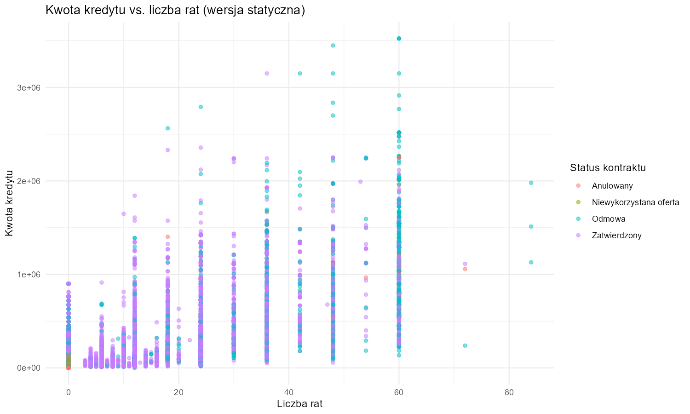
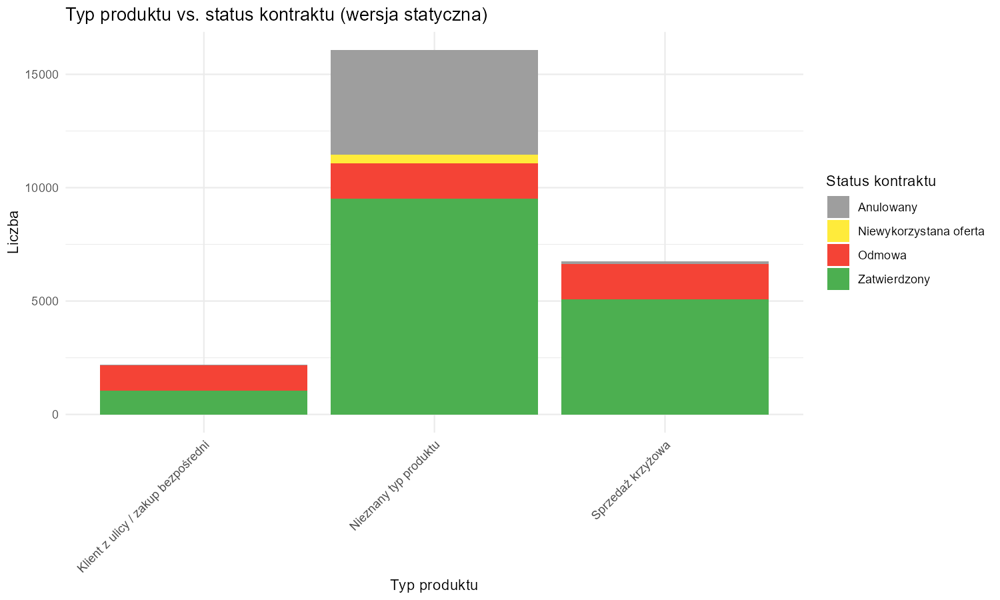

# Wizualna eksploracja danych w kontekście analizy ryzyka kredytowego

Po przeprowadzeniu procesu czyszczenia danych kolejnym krokiem jest ich [wizualna eksploracja]{.underline}. Wykresy umożliwiają szybkie uchwycenie zależności pomiędzy zmiennymi, identyfikację nietypowych obserwacji oraz porównanie rozkładów w różnych grupach klientów. Graficzne przedstawienie danych pozwala nie tylko na **lepsze zrozumienie** struktury zbioru, ale także na **wskazanie czynników ryzyka**, które mogą wpływać na decyzje kredytowe.

```{r przygotowanie_danych_wizualizacje, echo=FALSE}
library(tidyverse)

# Przygotowanie danych: tworzenie zmiennych z polskimi etykietami

# Mapa statusów kontraktu
status_map <- c(
  "Approved"   = "Zatwierdzony",
  "Canceled"   = "Anulowany",
  "Refused"    = "Odmowa",
  "Unused offer" = "Niewykorzystana oferta"
)

# Mapa typów klientów
client_map <- c(
  "New" = "Nowy",
  "Refreshed" = "Reaktywowany",
  "Repeater" = "Stały",
  "XNA" = "Nieznany"
)

# Mapa dni tygodnia
days_map <- c(
  "MONDAY"    = "Poniedziałek",
  "TUESDAY"   = "Wtorek",
  "WEDNESDAY" = "Środa",
  "THURSDAY"  = "Czwartek",
  "FRIDAY"    = "Piątek",
  "SATURDAY"  = "Sobota",
  "SUNDAY"    = "Niedziela"
)

# Mapa typów produktów
product_type_map <- c(
  "XNA"     = "Nieznany typ produktu",
  "x-sell"  = "Sprzedaż krzyżowa",
  "walk-in" = "Klient z ulicy / zakup bezpośredni"
)

# Mapa kolorów dla statusów kontraktu
status_colors <- c(
  "Zatwierdzony"          = "#4CAF50",  # zielony
  "Odmowa"                = "#F44336",  # czerwony
  "Anulowany"             = "#9E9E9E",  # szary
  "Niewykorzystana oferta"= "#FFEB3B"   # żółty
)

industry_map <- c(
  "Auto technology"       = "Technologia motoryzacyjna",
  "Clothing"              = "Odzież",
  "Connectivity"          = "Łączność",
  "Construction"          = "Budownictwo",
  "Consumer electronics"  = "Elektronika użytkowa",
  "Furniture"             = "Meble",
  "Industry"              = "Przemysł",
  "Jewelry"               = "Biżuteria",
  "MLM partners"          = "Partnerzy MLM",
  "Tourism"               = "Turystyka",
  "XNA"                   = "Pozostałe"
)

channel_map <- c(
  "AP+ (Cash loan)"              = "AP+ - Pożyczka gotówkowa",
  "Car dealer"                   = "Dealer objazdowy",
  "Channel of corporate sales"   = "Kanał sprzedaży korporacyjnej",
  "Contact center"               = "Centrum kontaktu",
  "Country-wide"                 = "Ogólnokrajowy",
  "Credit and cash offices"      = "Biura kredytowe i gotówkowe",
  "Regional / Local"             = "Regionalny / Lokalny",
  "Stone"                        = "Sklep"
)

reject_map <- c(
  "CLIENT" = "Klient",
  "HC"     = "Historia kredytowa",
  "LIMIT"  = "Przekroczony limit",
  "SCO"    = "Ocena punktowa",
  "SCOFR"  = "Ocena punktowa (FR)",
  "SYSTEM" = "Błąd systemowy",
  "VERIF"  = "Brak weryfikacji",
  "XAP"    = "Aplikacja testowa",
  "XNA"    = "Brak danych"
)

contract_type_map <- c(
  "Cash loans"      = "Gotówkowy",
  "Consumer loans"  = "Konsumencki",
  "Revolving loans" = "Ratalny (odnawialny)",
  "XNA"             = "Brak danych"
)


# Wszystkie transformacje w jednym miejscu
dane_clean <- dane_clean %>%
  mutate(
    NAME_CONTRACT_STATUS_PL = recode(NAME_CONTRACT_STATUS, !!!status_map, .default = NAME_CONTRACT_STATUS),
    NAME_CLIENT_TYPE_PL = dplyr::recode(NAME_CLIENT_TYPE, !!!client_map, .default = NAME_CLIENT_TYPE),
    WEEKDAY_PL = factor(
      dplyr::recode(WEEKDAY_APPR_PROCESS_START, !!!days_map, .default = WEEKDAY_APPR_PROCESS_START),
      levels = c("Poniedziałek", "Wtorek", "Środa", "Czwartek",
                 "Piątek", "Sobota", "Niedziela")
    ),
    NAME_PRODUCT_TYPE_PL = dplyr::recode(NAME_PRODUCT_TYPE, !!!product_type_map, .default = NAME_PRODUCT_TYPE),
    NAME_SELLER_INDUSTRY_PL = industry_map[NAME_SELLER_INDUSTRY],
    CHANNEL_TYPE_PL = channel_map[CHANNEL_TYPE],
    CODE_REJECT_REASON_PL = reject_map[CODE_REJECT_REASON],
    NAME_CONTRACT_TYPE_PL = contract_type_map[NAME_CONTRACT_TYPE]
  )
```

## Rozkład statusów kontraktu

```{r wykres_status_kontraktu, echo=FALSE}
# Podsumowanie danych z procentami
status_summary <- dane_clean %>%
  count(NAME_CONTRACT_STATUS_PL) %>%
  mutate(perc = round(n / sum(n) * 100, 1),
         label = paste0(n, "\n(", perc, "%)"))

# Kolejność statusów wg liczebności
status_order <- status_summary %>%
  arrange(desc(n)) %>%
  pull(NAME_CONTRACT_STATUS_PL)

dane_clean <- dane_clean %>% mutate(NAME_CONTRACT_STATUS_PL = factor(NAME_CONTRACT_STATUS_PL, levels = status_order))

# Wykres z sortowaniem wg liczebności malejąco
ggplot(status_summary, aes(x = fct_reorder(NAME_CONTRACT_STATUS_PL, n, .desc = TRUE),
                           y = n, fill = NAME_CONTRACT_STATUS_PL)) +
  geom_bar(stat = "identity") +
  geom_text(aes(label = label,
                vjust = ifelse(NAME_CONTRACT_STATUS_PL == "Zatwierdzony", 1.5, -1)),
            color = "black", size = 3.5) +
  scale_fill_manual(values = status_colors) +   # odwołanie do mapy zdefiniowanej wcześniej
  scale_y_continuous(expand = expansion(mult = c(0, 0.15))) +
  labs(title = "Rozkład statusów kontraktu",
       x = "Status kontraktu", y = "Liczba wniosków") +
  theme_minimal() +
  theme(axis.text.x = element_text(angle = 45, hjust = 1),
        legend.position = "none")
```

Wykres rozkładu statusów kontraktu pokazuje, że zdecydowana większość wniosków kończy się *zatwierdzeniem*, co sugeruje, że proces oceny zdolności kredytowej działa skutecznie i większość klientów spełnia wymagania instytucji finansowej. Jednocześnie widoczna jest znaczna liczba aplikacji *anulowanych* oraz *odrzuconych*, co wskazuje na obecność ryzyka w procesie decyzyjnym i sygnalizuje konieczność dalszej analizy czynników, które odróżniają te grupy od zatwierdzonych kontraktów. Niewielki udział niewykorzystanych ofert świadczy o tym, że sytuacje, w których klient nie skorzystał z przyznanego kredytu, są raczej incydentalne i nie mają dużego wpływu na ogólny obraz. Warto jednak pamiętać, że status „*zatwierdzony*” nie zawsze oznacza uruchomienie kredytu, ponieważ część takich wniosków nie posiada harmonogramu ani rat, co może wymagać dodatkowej segmentacji i odrębnego traktowania w dalszej analizie.

## Zależność pomiędzy wysokością przyznanego finansowania a statusem decyzji kredytowej

Odpowiada na pytanie - *czy większe kwoty częściej kończą się odmową*?

```{r wykres_kwota_wg_statusu, warning=FALSE, echo=FALSE}
ggplot(dane_clean %>% filter(AMT_CREDIT > 0),
       aes(x = NAME_CONTRACT_STATUS_PL, y = AMT_CREDIT, fill = NAME_CONTRACT_STATUS_PL)) +
  geom_boxplot() +
  labs(title = "Kwoty kredytów wg statusu kontraktu (skala log)",
       x = "Status kontraktu", y = "Kwota kredytu") +
  scale_y_log10(labels = label_number(scale_cut = cut_short_scale())) + 
  scale_fill_manual(values = status_colors) +
  theme_minimal() +
  theme(axis.text.x = element_text(angle = 45, hjust = 1),
        legend.position = "none")
```

Wykres pokazujący zależność [między kwotą kredytu a statusem kontraktu]{.underline} ujawnia, że najwyższe kwoty pojawiają się wśród wniosków [anulowanych]{.underline}. Oznacza to, że klienci często rezygnują z dużych zobowiązań jeszcze w trakcie procesu zatwierdzania – albo zmieniają zdanie co do pożyczki, albo nie akceptują gorszych warunków cenowych wynikających z wyższego ryzyka. Wnioski zatwierdzone obejmują szeroki zakres kwot, ale ich mediana jest **niższa** niż w *anulowanych*, co wskazuje, że w praktyce zatwierdzane są raczej kredyty średniej wielkości, a bardzo wysokie kwoty częściej kończą się rezygnacją. *Odmowy* dotyczą wniosków o kwoty **wyższe** niż przeciętne *zatwierdzone*, co sugeruje, że firma jest bardziej restrykcyjna wobec klientów starających się o większe kredyty i częściej odrzuca takie aplikacje, gdy nie spełniają wymagań instytucji. *Niewykorzystana oferta* to kategoria marginalna, ale jej rozkład kwot jest zbliżony do *zatwierdzonych*, co potwierdza, że klient miał zdolność kredytową, lecz zrezygnował z uruchomienia pożyczki na późniejszym etapie procesu. Całość wskazuje, że [im wyższa kwota kredytu]{.underline}, tym większe prawdopodobieństwo, że [wniosek zakończy się anulowaniem lub odmową]{.underline}, natomiast zatwierdzane są głównie kredyty o umiarkowanej wartości.

## Wpływ typu klienta na strukturę decyzji kredytowych

Odpowiada na pytanie - *czy nowi klienci częściej mają problemy ze spłatą*?

```{r wykres_typ_klienta_ryzyko, echo=FALSE}
# ile zatwierdzonych ma każdy typ klienta
client_order <- dane_clean %>%
  filter(NAME_CONTRACT_STATUS_PL == "Zatwierdzony") %>%
  count(NAME_CLIENT_TYPE_PL) %>%
  arrange(desc(n)) %>%
  pull(NAME_CLIENT_TYPE_PL)

# wykres
ggplot(dane_clean, aes(x = factor(NAME_CLIENT_TYPE_PL, levels = client_order),
                       fill = NAME_CONTRACT_STATUS_PL)) +
  geom_bar(position = "fill") +
  labs(title = "Status kontraktu wg typu klienta",
       x = "Typ klienta", y = "Proporcja", fill = "Status kontraktu") +
  scale_fill_manual(values = status_colors) +
  theme_minimal() +
  theme(axis.text.x = element_text(angle = 45, hjust = 1))
```

Wykres przedstawia **proporcje statusów kontraktu** w zależności od **typu klienta** i ujawnia, że największy udział *zatwierdzonych* wniosków występuje wśród nowych klientów. Może to świadczyć o tym, że instytucja finansowa jest otwarta na pozyskiwanie nowych odbiorców i chętnie udziela im kredytów, być może w ramach strategii rozwoju portfela lub przy stosunkowo niskich kwotach i uproszczonych produktach.

Stały klient, mimo że posiada historię kredytową, ma niższy udział zatwierdzeń niż nowy, a jednocześnie wyraźnie wyższy udział anulowań. To może sugerować, że **osoby z dłuższą relacją częściej rezygnują** z pożyczki na etapie zatwierdzania — być może ze względu na nieakceptowalne warunki cenowe lub zmianę decyzji.

Reaktywowany klient, czyli osoba powracająca po przerwie, ma rozkład statusów zbliżony do nowego klienta, ale z nieco większym udziałem odmów, co może wskazywać na **ostrożność instytucji** wobec klientów z przerwami w historii kredytowej.

Klienci oznaczeni jako „*Nieznany*” mają najwyższy udział odmów i najniższy zatwierdzeń, co może wynikać z braku danych lub niekompletnego profilu, który utrudnia ocenę ryzyka.

Całość wskazuje, że [typ klienta istotnie wpływa na decyzję kredytową]{.underline}: nowi klienci są najczęściej zatwierdzani, ale niekoniecznie oznacza to niższe ryzyko — może to być efekt strategii produktowej lub ograniczonej kwoty kredytu. Stały klient częściej rezygnuje, a nieznany jest najczęściej odrzucany.

## Zróżnicowanie decyzji kredytowych w zależności od dnia złożenia wniosku

Odpowiada na pytanie - *czy dzień złożenia wniosku ma wpływ na zatwierdzenie*?

```{r wykres_dzien_tygodnia_kwoty, warning=FALSE, echo=FALSE}
ggplot(dane_clean, aes(x = AMT_APPLICATION, fill = NAME_CONTRACT_STATUS_PL)) +
  geom_density(alpha = 0.4) +
  scale_x_log10(labels = scales::label_number(scale_cut = scales::cut_short_scale())) +
  facet_wrap(~WEEKDAY_PL, scales = "free_x") +
  labs(title = "Rozkład kwot wnioskowanych wg dnia tygodnia",
       x = "Kwota wnioskowana (log10)", y = "Gęstość",  fill = "Status kontraktu") +
  scale_fill_manual(values = status_colors) +
  theme_minimal()+
  theme(axis.text.x = element_text(angle = 45, hjust = 1),
        axis.text.y = element_text(size = 5),
        panel.spacing = unit(1, "lines"))
```

Rozkład kwot wnioskowanych w ciągu tygodnia jest zasadniczo **podobny** – dominują niższe wartości, a wyższe kwoty pojawiają się rzadziej i nie zmieniają kształtu gęstości. Różnice dotyczą głównie statusów kontraktu: w weekendy oraz w czwartek częściej pojawiają się *anulowane* wnioski, co może wynikać z większej liczby prób składanych online, które nie są finalizowane. W pozostałe dni, zwłaszcza w poniedziałek i piątek, widoczny jest szerszy zakres kwot i większy udział zatwierdzonych kontraktów. Czwartek wyróżnia się tym, że jego profil przypomina weekend – mniej wysokich kwot i relatywnie więcej anulowanych wniosków.

## Zależność pomiędzy długością okresu spłaty a wynikiem procesu kredytowego

Odpowiada na pytanie - *czy długość spłaty wpływa na ryzyko*?

```{r wykres_liczba_rat, echo=FALSE}
ggplot(dane_clean, aes(x = CNT_PAYMENT, fill = NAME_CONTRACT_STATUS_PL)) +
  geom_histogram(binwidth = 3, position = "dodge") +
  scale_y_continuous(labels = label_comma()) +
  labs(title = "Liczba rat wg statusu kontraktu",
       x = "Liczba rat", y = "Liczba wniosków", fill = "Status kontraktu") +
  scale_fill_manual(values = status_colors) +
  theme_minimal()
```

Większość wniosków dotyczy **krótkich** okresów spłaty — szczególnie w przedziale 6–24 rat. W tym zakresie dominują *zatwierdzone* kontrakty (zielony), co może świadczyć o większej akceptowalności krótszych zobowiązań przez instytucję finansową. W miarę wzrostu liczby rat udział zatwierdzeń maleje, a rośnie liczba *odmów* (czerwony) oraz *anulowań* (szary), co może wskazywać na wyższe ryzyko kredytowe lub większą skłonność klientów do rezygnacji przy dłuższych zobowiązaniach.

*Niewykorzystane oferty* (żółty) pojawiają się w różnych przedziałach liczby rat, ale nie dominują w żadnym z nich — mogą być efektem niezdecydowania klientów lub zmiany warunków po złożeniu wniosku.

Ogólnie rzecz biorąc, [krótsze okresy spłaty są częściej zatwierdzane]{.underline}, a [dłuższe wiążą się z większym udziałem odmów i anulowań]{.underline}, co warto uwzględnić w analizie ryzyka oraz w projektowaniu oferty kredytowej.

## Relacja pomiędzy wysokością finansowania a planowanym okresem spłaty

```{r wykres_interaktywny_scatter, echo=FALSE}
# Sprawdź format wyjściowy
is_html_output <- knitr::is_html_output()

if (is_html_output) {
  # Renderuj interaktywny wykres plotly dla HTML
  p <- plot_ly(dane_clean, x = ~CNT_PAYMENT, y = ~AMT_CREDIT,
          color = ~NAME_CONTRACT_STATUS_PL, colors = status_colors, type = "scatter", mode = "markers", marker = list(opacity = 0.4, size = 6)) %>%
    layout(
      title = "Kwota kredytu vs. liczba rat",
      xaxis = list(title = "Liczba rat"),
      yaxis = list(title = "Kwota kredytu",
                   tickformat=",.0f"),
      legend = list(title = list(text = "Status kontraktu")))
  
  # === SAVE PLOT TO FILE (comment out after first run) ===
  # Create a static ggplot version for placeholder
  # library(ggplot2)
  # p_static <- ggplot(dane_clean, aes(x = CNT_PAYMENT, y = AMT_CREDIT, color = NAME_CONTRACT_STATUS_PL)) +
  #   geom_point(alpha = 0.5) +
  #   scale_color_manual(values = status_colors) +
  #   scale_y_continuous(labels = label_comma())+
  #   labs(x = "Liczba rat", y = "Kwota kredytu", color = "Status kontraktu", 
  #        title = "Kwota kredytu vs. liczba rat (wersja statyczna)") +
  #   theme_minimal()
  # ggsave("../placeholder_images/placeholder_scatter.png", p_static, width = 10, height = 6, dpi = 150, create.dir = TRUE)
  # ========================================================
  
  htmltools::div(style = "text-align: center;", p)
} else {
  # Użyj placeholder dla markdown
  
}
```

*Zatwierdzone* kontrakty (zielony) najczęściej dotyczą umiarkowanych kwot i liczby rat — szczególnie od 10 do 40. *Odmowy* (czerwony) częściej pojawiają się przy wyższych kwotach i dłuższych okresach spłaty, co może wskazywać na większe ryzyko. *Anulowane* (szary) i *niewykorzystane oferty* (żółty) występują w różnych przedziałach, ale częściej przy niższych kwotach. Widoczne skupienie wokół typowych planów spłaty (12, 24, 36, 48, 60) sugeruje preferencje klientów i standardy ofertowe.

## Analiza współzależności zmiennych liczbowych z wykorzystaniem macierzy korelacji

Pokazuje, które zmienne są silnie powiązane z innymi (np. kwoty, liczba rat, dni decyzji).

```{r mapa_korelacji, echo=FALSE}
# wybieramy tylko zmienne numeryczne
num_vars <- dane_clean %>% select(where(is.numeric))

# obliczamy macierz korelacji
corr_matrix <- cor(num_vars, use = "pairwise.complete.obs")

# próg korelacji
threshold <- 0.3

# sprawdzamy maksymalną korelację dla każdej zmiennej
max_corr <- apply(abs(corr_matrix), 2, function(x) {
  vals <- x[!is.na(x) & x < 1]
  if (length(vals) == 0) return(0) else return(max(vals)) })

# wybieramy tylko zmienne, które mają korelację >= threshold
vars_to_keep <- names(max_corr[max_corr >= threshold]) 

# filturjemy macierz
filtered_matrix <- corr_matrix[vars_to_keep, vars_to_keep]

# Wykres tylko dla silnych korelacji
corrplot(filtered_matrix, method = "color", type = "upper", tl.cex = 0.6, tl.col = "black", na.label = " ")
```

Macierz korelacji pokazuje silne związki między kwotą kredytu (`AMT_CREDIT`), wnioskowaną kwotą (`AMT_APPLICATION`) i ceną towaru (`AMT_GOODS_PRICE`), co potwierdza spójność danych. Rata (`AMT_ANNUITY`) silnie koreluje z liczbą rat (`CNT_PAYMENT`) i kwotą kredytu (`AMT_CREDIT`). Zmienne harmonogramowe (`DAYS_FIRST_DRAWING`, `DAYS_FIRST_DUE`, `DAYS_LAST_DUE`, `DAYS_TERMINATION`) tworzą spójny blok czasowy. Wskaźniki procentowe (`RATE_DOWN_PAYMENT`, `RATE_INTEREST_PRIMARY`, `RATE_INTEREST_PRIVILEGED`) oraz flagi (`NFLAG_LAST_APPL_IN_DAY`, `NFLAG_INSURED_ON_APPROVAL`) mają słabe korelacje, co sugeruje ich niezależność i dodatkową wartość w modelach.

## Przepływy pomiędzy typem produktu a statusem kontraktu – analiza diagramem Sankeya

Pokazuje przepływ między typem produktu a statusem kontraktu.

```{r diagram_sankey, echo=FALSE}
# Sprawdź format wyjściowy
is_html_output <- knitr::is_html_output()

if (is_html_output) {
  # Renderuj interaktywny diagram Sankey dla HTML
  links <- dane_clean %>%
    count(NAME_PRODUCT_TYPE, NAME_CONTRACT_STATUS, name = "Value") %>%
    rename(Source = NAME_PRODUCT_TYPE, Target = NAME_CONTRACT_STATUS)
  
  nodes <- data.frame(name = unique(c(links$Source, links$Target)))
   
  links$Source <- match(links$Source, nodes$name) - 1
  links$Target <- match(links$Target, nodes$name) - 1
  
 
  # Zmiana etykiet na polskie
  nodes$name <- dplyr::recode(nodes$name, "Approved" = "Zatwierdzony",
                              "Canceled" = "Anulowany",
                              "Refused" = "Odmowa",
                              "Unused offer" = "Niewykorzystana oferta",
                              "x-sell" = "Sprzedaż krzyżowa",
                              "walk-in" = "Klient z ulicy / zakup bezpośredni", 
                              "XNA" = "Nieznany typ produktu")

  
  s <- sankeyNetwork(Links = links, Nodes = nodes,
                Source = "Source", Target = "Target",
                Value = "Value", NodeID = "name",
                fontSize = 12, nodeWidth = 30,
                colourScale = JS( paste0("d3.scaleOrdinal().domain(['", paste(names(status_colors), collapse = "','"), "']).range(['", paste(status_colors, collapse= "','"), "'])") ) )
  
  # === SAVE PLOT TO FILE (comment out after first run) ===
  # Create a static ggplot version for placeholder (Sankey is complex, so just save a simple bar chart)
  # library(ggplot2)
  # s_static <- dane_clean %>%
  #   count(NAME_PRODUCT_TYPE_PL, NAME_CONTRACT_STATUS_PL) %>%
  #   ggplot(aes(x = NAME_PRODUCT_TYPE_PL, y = n, fill = NAME_CONTRACT_STATUS_PL)) +
  #   geom_col(position = "stack") +
  #   scale_fill_manual(values = status_colors) +
  #   labs(x = "Typ produktu", y = "Liczba", fill = "Status kontraktu",
  #        title = "Typ produktu vs. status kontraktu (wersja statyczna)") +
  #   theme_minimal() +
  #   theme(axis.text.x = element_text(angle = 45, hjust = 1))
  # ggsave("../placeholder_images/placeholder_sankey.png", s_static, width = 10, height = 6, dpi = 150, create.dir = TRUE)
  # ========================================================
  
    htmltools::div(style = "text-align: center;", s)
} else {
  # Użyj placeholder dla markdown
  
}
```

Największa liczba kontraktów pochodzi z kategorii „*Nieznany typ produktu*”, a tylko w tej grupie występują *niewykorzystane oferty* (żółty), co może wskazywać na problem z klasyfikacją lub mniejszą atrakcyjność oferty. *Odmowy* (czerwony) i *anulowania* (szary) pojawiają się we wszystkich typach produktów, ale ich udział jest szczególnie widoczny w grupie nieznanej. W pozostałych kategoriach (*„sprzedaż krzyżowa”*, *„klient z ulicy / zakup bezpośredni”*) dominują *zatwierdzone* kontrakty, co sugeruje, że [bardziej jednoznacznie zdefiniowane produkty częściej kończą się pozytywną decyzją]{.underline}.

## Wpływ branży sprzedawcy na wynik procesu kredytowego

Odpowiada na pytanie - *czy branża wpływa na decyzję kredytową*?

```{r wykres_branza_sprzedawcy, echo=FALSE}
ggplot(dane_clean, aes(x = NAME_SELLER_INDUSTRY_PL, fill = NAME_CONTRACT_STATUS_PL)) +
  geom_bar(position = "fill") +
  scale_fill_manual(values = status_colors) +
  labs(x = "Branża sprzedawcy", y = "Udział statusów",
       fill = "Status kontraktu",
       title = "Status kontraktu w zależności od branży sprzedawcy") +
  theme_minimal() +
  theme(axis.text.x = element_text(angle = 45, hjust = 1))
```

Branża turystyki wyróżnia się tym, że wszystkie kontrakty zostały w niej *zatwierdzone* — nie odnotowano żadnych *odmów*, *anulowań* ani *niewykorzystanych ofert*. W pozostałych branżach struktura odmów jest stosunkowo podobna, co sugeruje, że decyzje negatywne nie są silnie zależne od sektora sprzedawcy. Najwięcej anulowań występuje wśród partnerów MLM oraz w kategorii „Pozostałe”, co może wskazywać na większą niestabilność lub niejednoznaczność ofert w tych grupach.

## Zależność pomiędzy kanałem sprzedaży a decyzją kredytową

Odpowiada na pytanie - *czy kanał sprzedaży wpływa na decyzję kredytową*?

```{r wykres_kanal_sprzedazy, echo=FALSE}
ggplot(dane_clean, aes(x = CHANNEL_TYPE_PL, fill = NAME_CONTRACT_STATUS_PL)) +
  geom_bar(position = "fill") +
  scale_fill_manual(values = status_colors) +
  labs(x = "Kanał pozyskania klienta", y = "Udział statusów",
       fill = "Status kontraktu",
       title = "Status kontraktu w zależności od kanału pozyskania klienta") +
  theme_minimal() +
  theme(axis.text.x = element_text(angle = 45, hjust = 1))
```

Najlepsze wyniki osiągają kanały `Sklep` oraz `Regionalny/Lokalny`, gdzie dominują *zatwierdzone* kontrakty, a udział *odmów* jest niewielki. Z kolei `Kanał sprzedaży korporacyjnej` oraz `Dealer samochodowy` charakteryzują się wyraźnie wyższym udziałem odmów, co może wskazywać na większe ryzyko lub bardziej wymagające profile klientów. Najwięcej *anulowań* występuje w kanałach `Biura kredytowe i gotówkowe` oraz `Centrum kontaktu`, co może świadczyć o niestabilności procesu lub częstszej rezygnacji klientów na późniejszym etapie.

## Analiza głównych przyczyn odrzucenia wniosków kredytowych

```{r wykres_powody_odmow, echo=FALSE}
dane_clean %>%
  filter(NAME_CONTRACT_STATUS_PL == "Odmowa") %>%
  count(CODE_REJECT_REASON_PL) %>%
  ggplot(aes(x = reorder(CODE_REJECT_REASON_PL, -n), y = n)) +
  geom_col(fill = "red") +
  labs(x = "Powód odrzucenia", y = "Liczba odmów",
       title = "Najczęstsze powody odrzucenia aplikacji") +
  theme_minimal()+
  theme(axis.text.x = element_text(angle = 45, hjust = 1))
```

Najczęstszym powodem odrzucenia jest **historia kredytowa**, co może wskazywać na dużą liczbę klientów z negatywną historią lub brak zdolności kredytowej. Kolejne dominujące przyczyny to przekroczony limit oraz ocena punktowa, co sugeruje, że wiele aplikacji odpada na etapie scoringu lub limitów wewnętrznych. Powody takie jak brama punktowa, brak weryfikacji czy błąd systemowy występują znacznie rzadziej, ale mogą wskazywać na problemy techniczne lub niedopełnienie formalności.

## Wpływ rodzaju umowy kredytowej na strukturę decyzji

Odpowiada na pytanie - *czy rodzaj umowy wpływa na decyzję kredytową?*

```{r wykres_typ_umowy, echo=FALSE}
ggplot(
  subset(dane_clean, NAME_CONTRACT_TYPE != "XNA"),
  aes(x = NAME_CONTRACT_TYPE_PL, fill = NAME_CONTRACT_STATUS_PL)
) +
  geom_bar(position = "fill") +
  scale_fill_manual(values = status_colors) +
  labs(x = "Typ umowy", y = "Udział statusów",
       fill = "Status kontraktu",
       title = "Status kontraktu w zależności od typu umowy") +
  theme_minimal() +
  theme(axis.text.x = element_text(angle = 45, hjust = 1))
```

Umowy konsumenckie mają **najwyższy** udział *zatwierdzonych* kontraktów, co wskazuje na ich dużą skuteczność i akceptowalność w procesie kredytowym. Umowy gotówkowe i ratalne charakteryzują się większym udziałem *anulowań* i *odmów*, co może wskazywać na wyższe ryzyko lub mniej stabilny profil klienta.

## Zależność pomiędzy godziną złożenia wniosku a wynikiem procesu kredytowego

Odpowiada na pytanie - *czy godzina złożenia wniosku ma wpływ na decyzję kredytową?*

```{r wykres_godzina_aplikacji, echo=FALSE}
ggplot(dane_clean, aes(x = HOUR_APPR_PROCESS_START)) +
  geom_histogram(binwidth = 1, fill = "white", color = "black") +
  facet_wrap(~NAME_CONTRACT_STATUS_PL, ncol = 2) +
  labs(x = "Godzina aplikacji", y = "Liczba wniosków",
       title = "Rozkład godzin aplikacji wg statusu kontraktu") +
  theme_minimal() +
  theme(strip.text = element_text(face = "bold"),
        panel.background = element_rect(fill = "white"),
        panel.grid.major = element_line(color = "gray90"))
```

*Zatwierdzone* wnioski najczęściej pojawiają się między godziną 11 a 19, z wyraźnym szczytem około 12:00–13:00. To może wskazywać na optymalny czas składania aplikacji. *Odmowy* również koncentrują się wokół godziny 13:00, co może sugerować, że system scoringowy działa intensywnie w tym przedziale. *Anulowania* są bardziej rozproszone, ale również mają lokalny szczyt około 13:00, co może wskazywać na decyzje systemowe lub rezygnacje klientów. *Niewykorzystane oferty* są najrzadsze, ale też pojawiają się głównie w godzinach 11–14, co może oznaczać, że klienci rezygnują tuż po otrzymaniu decyzji.

## Wpływ ubezpieczenia na relację pomiędzy ceną towaru a statusem kontraktu

Odpowiada na pytanie - *czy ubezpieczenie wpływa na cenę towaru*?

```{r wykres cena_vs_status, echo=FALSE}
ggplot(dane_clean, aes(x = NAME_CONTRACT_STATUS_PL,
                       y = log10(AMT_GOODS_PRICE),
                       fill = factor(NFLAG_INSURED_ON_APPROVAL, labels = c("Bez ubezp.", "Z ubezp.")))) +
  geom_boxplot() +
  labs(x = "Status kontraktu", y = "Cena towaru (log10)",
       fill = "Ubezpieczenie",
       title = "Cena towaru (logarytmicznie) wg statusu i ubezpieczenia") +
  theme_minimal()
```

Wśród *zatwierdzonych* wniosków, aplikacje z ubezpieczeniem mają wyższą medianę ceny towaru niż te bez. Zatwierdzone bez ubezpieczenia wykazują dużo skrajnych, bardzo wysokich wartości — większy rozrzut, mniej stabilny profil.

## Zróżnicowanie kwot wnioskowanych w zależności od typu klienta i kanału sprzedaży

Odpowiada na pytanie - *czy typ klienta i kanał wpływają na kwotę wnioskowaną?*

```{r wykres_kwota_typ_klienta_kanal, echo=FALSE}
ggplot(dane_clean, aes(x = CHANNEL_TYPE_PL, y = AMT_APPLICATION/1000, fill = CHANNEL_TYPE_PL)) +
  geom_boxplot() +
  facet_wrap(~NAME_CLIENT_TYPE_PL) +
  labs(x = "Kanał pozyskania klienta", 
       y = "Kwota wnioskowana (w tys.)",
       title = "Kwota wnioskowana wg kanału pozyskania, facet: typ klienta") +
  theme_minimal() +
  theme(axis.text.x = element_text(angle = 45, hjust = 1),
        legend.position = "none")
```

Stały klient wnioskuje o najwyższe kwoty u **dealerów objazdowych** i w **kanałach** **sprzedaży korporacyjnej**. W tych kanałach mediany są wyraźnie wyższe niż w pozostałych, choć rozrzut wartości jest również większy, co wskazuje na zróżnicowany profil klientów. Nowi klienci utrzymują niższe mediany, ale w kanałach typu *„Dealer objazdowy”* pojawiają się skrajnie wysokie wartości. Reaktywowany klient ma rozkład zbliżony do nowego, lecz bardziej przewidywalny. Nieznany typ klienta nie wykazuje ani wysokich median, ani skrajnych wartości — jego profil jest raczej neutralny.
